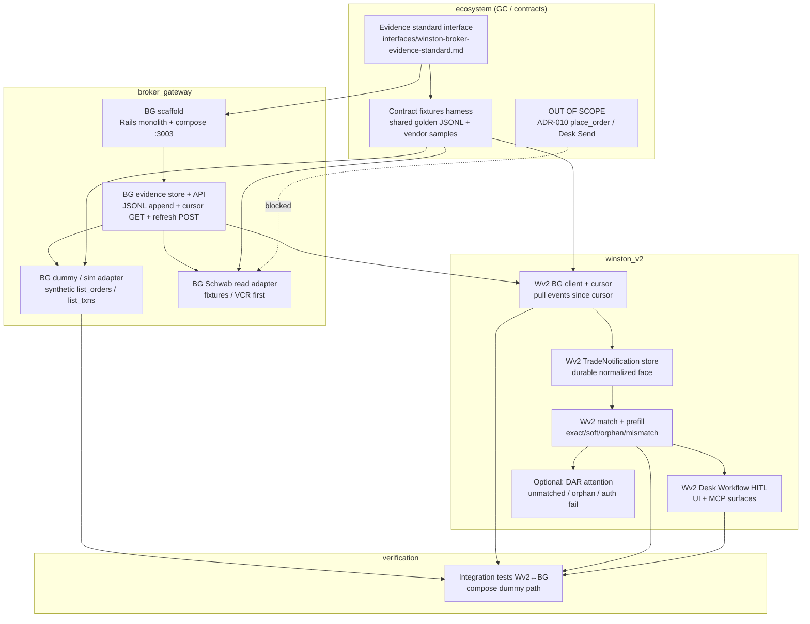
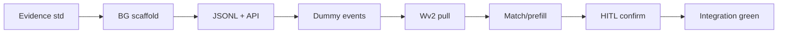

# L1 Confirmation Intake — Phase 6–7 Work Graph

**Date:** 2026-08-09  
**Status:** Implementation sequencing reference (not authorization to code)  
**Mode:** contractor (default); ultrawork after contract freeze  
**Graph nodes:** `ecosystem`, `broker_gateway` (to scaffold), `winston_v2`  
**Series:** `trade-fulfillment-engine` / L1 Confirmation Intake  
**Parent plan:** [`plans/trade-fulfillment-engine.md`](../../plans/trade-fulfillment-engine.md) (Phase 5–7, Grill B Q1–Q7)  
**Session basis:** [`docs/session-reports/2026-08-09-1408-trade-fulfillment-grill-b.md`](../session-reports/2026-08-09-1408-trade-fulfillment-grill-b.md)  
**Do not implement from this doc alone** — tickets authorize work; this maps *order* and *parallelism*.

---

## 1. Goal statement

**Ship an L1 Confirmation Intake read path** so Winston can:

1. Authenticate a read-capable adapter (via **Broker Gateway**).
2. Poll/list order + transaction evidence.
3. Normalize and store durable events (**Winston Broker Evidence Standard**).
4. Surface **Trade Notifications** in **Winston v2 (Wv2)**.
5. Match notifications to a **Single Fulfillment Identity** (draft Journal / task).
6. Prefill Desk Workflow fields from evidence.
7. Still require a human **Desk Confirm** (or **Corrective Amend**) — **no silent book**.

**Explicit non-goals for this slice:**

| Out of scope | Why |
|--------------|-----|
| **L3 `place_order` / Desk Send** | Requires ADR-010; Grill B Q6 |
| **L2 position/balance reconcile as capital** | Hints only later; balances never `capital_base` |
| **Email as primary SoT** | Grill A: API poll primary |
| **Autotrader / silent Position open from notifications** | ADR-009 / Human-Gated |
| **Full OP↔account binding grill (Q8)** | Deferred after build; provisional binding sufficient for vertical slice |
| **Match rule perfection (Q9 detail)** | Deferred; ship exact/soft/orphan with clear attention |

**Success means:** the full intake *workflow* is exercised end-to-end (ideally with a **dummy/sim** adapter first), and the human still clicks Confirm. Capital books only through existing `JournalConfirmationService` / amend paths.

---

## 2. Paper trades policy — **LOCKED 2026-08-09** (operator)

**Decision:** Paper Operational Portfolios (OPs) default to Broker Gateway adapter key **`dummy_sim`** so Confirmation Intake is **always exercised**. Grill B “Manual zero-IO” is narrowed to an **escape hatch**, not the paper default.

```
paper OP (default)
  → BG dummy_sim refresh (synthetic order/txn events, no live credentials)
  → Winston Broker Evidence Standard JSONL
  → Wv2 pull by cursor
  → match → prefill
  → human Desk Confirm  (still required — no silent book)
```

### 2.1 Product matrix (locked)

| OP `execution_mode` | `fulfillment_adapter_key` | BG IO? | Evidence |
|---------------------|---------------------------|--------|----------|
| `paper` | **`dummy_sim` (default)** | Yes (synthetic) | Full L1 intake; no live broker |
| `paper` | `manual` (escape hatch) | No | Human types only (L0) |
| `real` | `manual` | No | Human books outside Winston |
| `real` | `schwab_trader_api` (read) | Yes | Live/fixture read path |

### 2.2 Implications

1. **Compose:** `broker_gateway` on **:3003** required for paper-intake demos and CI integration.
2. **Tests:** integration Wv2↔BG **dummy_sim** always on; Schwab behind fixtures then sandbox spike.
3. **Registry key freeze:** **`dummy_sim`** (not bare `dummy` / `sim_dummy`).
4. **Never:** paper OP → live Schwab credentials or `order_write`.
5. **Capital Activation for real** may still default Manual (B5) until real L1 binding is chosen; paper import default → `dummy_sim`.

---

## 3. Dependency DAG

Nodes below map Phase 6–7 build work. Edges are hard dependencies (cannot start consumer work that *merges* until producer contract is frozen — stub clients OK before freeze only in isolated worktrees).



**Notes on edges:**

- **Schwab read adapter** depends on evidence store + fixtures; live credentials only after sandbox spike verdict — not on critical path for first vertical slice.
- **HITL UI** depends on match/prefill producing draft field deltas; can *stub* prefill UI with fake MatchResult in a worktree, but merge after WMP.
- **DAR attention** is optional for vertical slice DoD; highly valuable for orphans/auth fail (G19/G21).
- **ADR-010 / place_order** is an isolated dead-end node — do not schedule.

---

## 4. Parallel swimlanes

**Mode:** contractor per monolith; **ultrawork** only after **Merge Gate 1** (evidence contract freeze).

| Lane | Owner | Can start when | Parallel with | Primary deliverables |
|------|-------|----------------|---------------|----------------------|
| **L0 — GC / contracts** | ecosystem GC session | Immediately (authorized) | All (until freeze) | Evidence standard interface draft; fixture schema; ticket names; compose port note; paper policy lock |
| **L1 — BG scaffold** | BG contractor | Evidence *skeleton* agreed (fields list OK) | L0 polish; L2 fixture drafting | `broker_gateway/` Rails app, Containerfile, compose service host **:3003**, health endpoint, empty registry |
| **L2 — BG evidence + API** | BG contractor | Scaffold boots | L0; L3 dummy design; L5 Wv2 client *against frozen OpenAPI stub* | JSONL append store, idempotency keys, `POST .../refresh`, `GET .../events?cursor=`, binding registry PG |
| **L3 — BG dummy adapter** | BG contractor | Evidence store write path | L5–L6 (Wv2) after API contract freeze | `dummy`/`sim` CapabilityProfile (`auth`+`order_read`+`txn_read`); emit golden fixtures |
| **L4 — BG Schwab read** | BG contractor (later) | Dummy green + fixtures harness | Optional parallel to L7–L8 if no shared BG files thrash | Fixture/VCR normalize; **no live until spike** |
| **L5 — Wv2 BG client + cursor** | Wv2 contractor | **Merge Gate 1** (API contract freeze) | L3 dummy finish; L6 store schema | HTTP client, cursor persistence per binding, pull job |
| **L6 — Wv2 TradeNotification store** | Wv2 contractor | Can start schema design with L0; implement after Gate 1 event shape | L5 | Model/migration, idempotent insert from evidence events |
| **L7 — Wv2 match + prefill** | Wv2 contractor | L6 store + draft Journal/task links exist | L4; not parallel with second agent editing same match service | `match_notification`, `prefill_from_match`; SingleFulfillmentGuard respect |
| **L8 — Desk Workflow HITL** | Wv2 contractor | L7 produces deltas (or stub) | L9 optional DAR | Prefill on `/operations/workflow`; MCP confirm still human; no auto-book |
| **L9 — DAR attention (optional)** | Wv2 contractor | L7 MatchResult kinds | L8 | Unmatched/orphan/auth-fail bands (ticket may already exist for process-miss) |
| **L10 — Contract fixtures harness** | ecosystem or either monolith (shared path) | L0 event schema draft | All adapters | Golden JSONL under `ecosystem/interfaces/fixtures/` or agreed path |
| **L11 — Integration Wv2↔BG** | GC + both | L3 + L5–L8 vertical slice | — | Compose smoke: dummy refresh → pull → match → prefill → human confirm |

### Merge gates (hard)

| Gate | Freeze what | Who signs | Unblocks |
|------|-------------|-----------|----------|
| **MG0 — Paper policy** | Option A vs B (§2) | Operator | Paper OP adapter defaults; whether compose always runs BG for paper demos |
| **MG1 — Evidence contract** | Event schema, idempotency key, cursor semantics, refresh command shape | GC (+ BG/Wv2 read) | Dual implement of BG store and Wv2 client |
| **MG2 — Dummy capability profile** | Registry key name (`dummy` vs `sim`), capability flags, synthetic event examples | GC | Integration path without Schwab |
| **MG3 — Vertical slice merge** | Dummy E2E green in compose | GC + verify | Schwab adapter work prioritized; optional DAR polish |
| **MG4 — Live read** | Sandbox spike verdict + redacted fixtures | Operator + spike ticket | Live Schwab poll on dedicated binding only |

**Rule:** After MG1, **do not** change event field names without a version bump (`schema_version`) and dual client/store update in one integration PR.

---

## 5. Sequential critical path

**Shortest path to first vertical slice** (recommended): **dummy adapter end-to-end before Schwab live.**

```
1. Evidence standard (ecosystem interface draft)
2. BG scaffold (Rails + compose :3003)
3. JSONL evidence store + refresh/events API
4. Dummy adapter emits synthetic order/txn events
5. Wv2 BG client pulls by cursor
6. TradeNotification store (idempotent)
7. Match + prefill against draft Journal/task
8. Desk Confirm remains human (JournalConfirmationService)
9. Integration specs (compose dummy)
```

**Estimated sequential critical path (dependency-only, not calendar):**



**What can fan out without lengthening critical path:**

- Fixture authoring (L10) in parallel with scaffold once schema draft exists.
- Schwab fixture adapter (L4) **after** dummy green — not on first slice.
- DAR attention (L9) after match kinds exist — optional for DoD.
- Capital exit-reconcile (D10 ticket) is **orthogonal** to L1 intake vertical slice (do not block Confirm path).

**Existing Wv2 anchors (reuse, do not reimplement):**

| Piece | Location (pattern) |
|-------|--------------------|
| Desk Confirm book | `Operations::JournalConfirmationService` |
| Corrective amend | `Operations::JournalExecutedAmendService` |
| Single fulfillment | `Operations::SingleFulfillmentGuard` |
| Desk Workflow UI | `Operations::DeskWorkflowsController`, `/operations/workflow` |
| Desk request specs | `spec/requests/operations_desk_workflow_spec.rb` |
| Next-open prefill (signal) | `Operations::EodCadence` / `InternalJournalPresenter` — **extend**, do not replace with broker price silently |
| Ops shell / MCP confirm | `OpsShellChat`, internal API confirm endpoints |

**IngestNotificationOrchestrator (plan §4.4)** is the Wv2-side owner of: pull → normalize face → store TN → match → prefill or attention. Transport stays in BG.

---

## 6. Agent assignment map

### 6.1 Safe parallel pairs (separate worktrees / repos)

| Pair | Why safe |
|------|----------|
| **BG scaffold/store** ↔ **ecosystem interface doc** | Different trees; coordinate field names at MG1 only |
| **BG dummy adapter** ↔ **Wv2 TradeNotification migration** | After MG1; no shared files |
| **BG Schwab fixtures** ↔ **Wv2 match rules** | After dummy path; shared only via fixtures path (read-only consumers) |
| **Fixture harness** ↔ **either monolith unit tests** | Fixtures are read-only inputs once frozen |
| **DAR attention UI** ↔ **BG ops UI (minimal)** | Different products |

### 6.2 Shared contract freeze points

1. **MG0** paper policy (operator).  
2. **MG1** evidence event schema + API (GC).  
3. **MG2** dummy registry key + sample events.  
4. Cursor token format (`opaque` string recommended, not integer wall-clock only).  
5. Binding id representation (provisional until Grill B Q8 — use BG binding UUID; Wv2 stores opaque ref).

### 6.3 Forbidden parallel edits

| Conflict zone | Why |
|---------------|-----|
| Two agents on **`JournalConfirmationService`** | Capital path; double-book risk; SingleFulfillmentGuard |
| Two agents on **same match service** / MatchResult enum | Divergent match semantics |
| Two agents on **BG JSONL writer + idempotency** | Corrupt evidence SoT |
| Two agents on **root `compose.yml`** without coordination | Port/env collisions |
| Inventing **evidence fields** in Wv2 without interface doc | Contract thrash |
| **place_order** / write credentials in any L1 PR | Violates ADR-010 boundary |

### 6.4 Contractor vs tournament

| Work | Mode |
|------|------|
| BG scaffold shape, API names, dummy events | **Contractor** (design already Grill B locked) |
| Match scoring heuristics (exact vs soft) | Optional **tournament** only if two viable algorithms + scorecard; else contractor with fixture table |
| Schwab sandbox availability | Spike ticket (not tournament) |

**Ultrawork:** after MG1 + ticket DoD locked, fan out L3/L5/L6/L7 with integration gate at MG3.

---

## 7. Test strategy

Aligned with plan §9.3 contract matrix (L1 rows only).

### 7.1 Unit

| Area | Owner | Assert |
|------|-------|--------|
| `normalize_notification` | BG (+ pure lib if shared) | Vendor/dummy payload → canonical event fields |
| JSONL idempotency | BG | Duplicate vendor event id → one logical event |
| Cursor pagination | BG | `since` cursor returns only new events; stable order |
| Match rules | Wv2 | exact / soft / ambiguous / orphan / mismatch tables |
| Prefill deltas | Wv2 | Draft fields updated; status remains draft; **no** Position open |
| SingleFulfillmentGuard | Wv2 (existing) | Second book still refused without force+notes |

### 7.2 Contract

| Area | Location | Assert |
|------|----------|--------|
| Shared golden JSONL | ecosystem fixtures | Both BG writer and Wv2 reader accept same bytes |
| API OpenAPI or markdown contract | `interfaces/winston-broker-evidence-standard.md` | Status codes, error shapes, capability flags |
| CapabilityProfile | BG registry | dummy: `auth`+`order_read`+`txn_read`; no `order_write` |

### 7.3 Integration

| Scenario | How |
|----------|-----|
| Wv2 against BG **dummy** in compose | `bin/compose up` DM+WUT+Wv2+BG; refresh dummy binding; pull; match fixture journal |
| Human still confirms | After prefill, confirm only via desk/MCP; assert Position created on confirm only |
| Auth fail / empty poll | Fail closed + attention (if L9 present); no invent fills |

### 7.4 HITL

| Surface | Spec type |
|---------|-----------|
| Desk Workflow shows prefilled price/qty/evidence badge | request or system spec |
| Confirm books once; amend path for mismatch | request specs extending `operations_desk_workflow_spec` |
| MCP/internal confirm with attached notification id | contract/request |
| Orphan notification requires human link, not auto-create draft enter | service + request |

### 7.5 Explicit test bans

- **No live Schwab** until sandbox spike ticket verdict and MG4.  
- **No paperMoney-as-API** assumptions.  
- **No** test that expects silent book-from-notification.  
- **No** `place_order` contract tests in L1 PRs.

---

## 8. Risks

| Risk | Severity | Mitigation |
|------|----------|------------|
| **Q8 binding deferred** (multi-OP same broker account) | High for multi-OP real | Provisional: one binding → many OPs match by symbol+side+time window only; surface **ambiguous** MatchResult; lock Q8 before multi-OP live read |
| Multi-OP same account double-match | High | Prefer exact external ids when present; else soft match + human attach; never auto-book |
| Secrets in Wv2 process | High | BG owns OAuth tokens; Wv2 only opaque binding ids + internal API |
| Compose port **3003** collision | Med | Document in compose comments; reserve `broker_gateway` host 3003 internal 3000 (same pattern as DM/WUT/Wv2) |
| Paper policy ambiguity (A vs B) | Med | §2 PENDING; default engineering to dummy-in-BG for tests; Manual remains escape |
| Event schema thrash after dual implement | High | MG1 freeze + `schema_version` |
| Schwab sandbox unavailable | Med | Fixtures + dummy remain green path; spike ticket owns live confidence |
| Prefill overwrites intentional stop-aligned price | Med | Prefill suggests; human confirms; amend remains post-book path (D11) |
| Orphans fill JSONL forever | Low | Retention policy later; orphans first-class by Grill B Q4 |
| Scope creep to L3 | High | OOS node; refuse `order_write` PRs |

---

## 9. Definition of done — L1 vertical slice

The **dummy adapter end-to-end** slice is **done** when all of the following hold:

### Product

- [ ] Human still required for **Desk Confirm** / **Corrective Amend** (no silent Position from evidence).
- [ ] Evidence path produces a **Trade Notification** matched or orphaned with operator-visible status.
- [ ] Prefill appears on Desk Workflow (or MCP equivalent) when match is exact/soft.
- [ ] Paper policy decided (MG0) and reflected in defaults docs.
- [ ] No live Schwab credentials required for this DoD.

### Contracts & platform

- [ ] `ecosystem/interfaces/winston-broker-evidence-standard.md` (or agreed name) exists with event schema + API.
- [ ] Shared contract fixtures cover at least: fill, cancel/reject (or status), duplicate idempotency, orphan.
- [ ] `broker_gateway` scaffolds, boots in compose on **:3003**, health OK.
- [ ] Dummy/sim adapter registered with L1 capabilities only.

### Wv2

- [ ] BG client + durable cursor.
- [ ] TradeNotification (or equivalent) store idempotent on evidence event id.
- [ ] Match + prefill services with unit tables.
- [ ] Desk Workflow / request specs cover prefilled confirm still using `JournalConfirmationService`.
- [ ] SingleFulfillmentGuard still enforced.

### Verification

- [ ] Unit: normalize, idempotency, match rules green.
- [ ] Contract: fixtures shared green on BG + Wv2.
- [ ] Integration: compose dummy refresh → pull → match → prefill → human confirm → one Position.
- [ ] No ADR-010 / place_order code merged.

### Explicitly not required for this DoD

- Live Schwab read, email ingest, L2 balances, Exit Capital Reconcile math, Q8 final binding model, full DAR polish, BG rich ops UI beyond health/bindings/logs.

---

## 10. Ticket names that should exist (reference only — not filed here)

Other agents own full ticket filing. Suggested names for the wave:

| Suggested ticket | Lane |
|------------------|------|
| `…-winston-broker-evidence-standard-interface` | L0 / MG1 |
| `…-broker-gateway-scaffold-compose` | L1 |
| `…-bg-evidence-store-jsonl-api` | L2 |
| `…-bg-dummy-sim-adapter` | L3 |
| `…-wv2-bg-client-cursor-pull` | L5 |
| `…-wv2-trade-notification-store` | L6 |
| `…-wv2-match-prefill-intake` | L7 |
| `…-wv2-desk-workflow-evidence-prefill-hitl` | L8 |
| `…-wv2-bg-dummy-integration-compose` | L11 |
| `…-bg-schwab-read-fixtures` (after dummy) | L4 |
| Existing: `2026-08-07-schwab-trader-api-sandbox-spike` | MG4 |
| Optional: DAR orphan/unmatched attention (link process-miss ticket) | L9 |

---

## 11. Architecture reminder (ownership split)

```
Daily Analysis → draft Journal / Desk Handoff          (Signal Spine)
        │
        ▼
IngestNotification (Wv2): pull BG → TN store → match → prefill / attention
        │
        ▼
HITL Desk Confirm / Corrective Amend                   (Booked Capital Spine)
        │
        ▼
JournalConfirmationService / Amend / SingleFulfillmentGuard

broker_gateway: OAuth, poll, JSONL evidence, dummy|schwab adapters
        ▲
        │  never journals / capital_base / Desk Confirm policy
```

**Manual** remains zero-IO in Wv2 when selected. **Dummy** (if MG0 Option B) is a BG adapter for workflow practice, not a live broker.

---

## 12. Related artifacts

| Artifact | Role |
|----------|------|
| `plans/trade-fulfillment-engine.md` | Phases 5–7, atomics, Grill B locks |
| `CONTEXT.md` | Confirmation Intake, BG, Desk Confirm/Send, Trade Notification |
| `docs/business-context/human-gated-desk-and-fulfillment.md` | Human-Gated law |
| `docs/session-reports/2026-08-09-1408-trade-fulfillment-grill-b.md` | Q1–Q7 locks |
| `docs/tickets/2026-08-07-schwab-trader-api-sandbox-spike.md` | Live sandbox confidence |
| `WORK_GRAPH.md` | contractor / tournament / ultrawork |
| Wv2 services above | Existing book path patterns |

---

*End of work graph. Implementation requires ticket authorization and MG0–MG1 freezes.*
