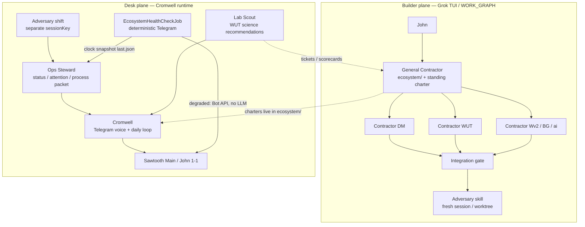
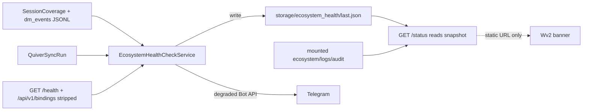
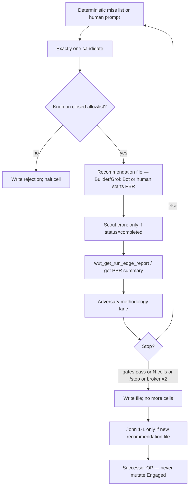
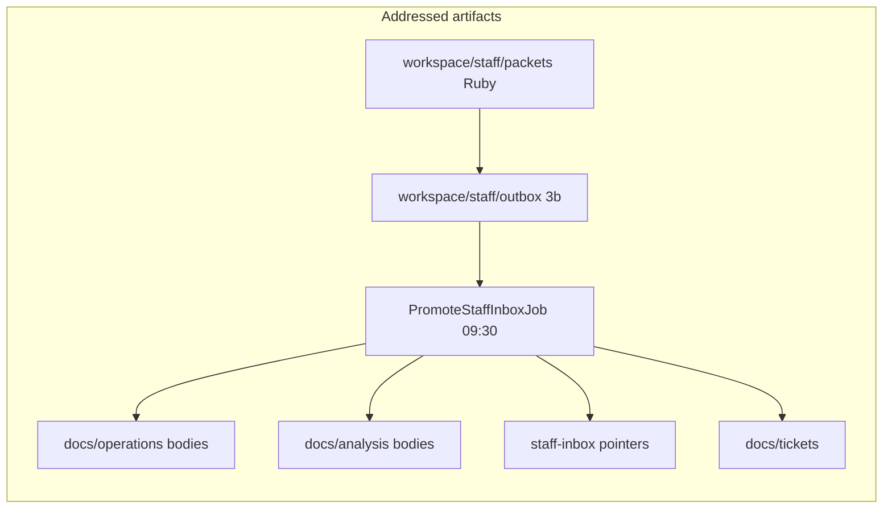

# Winston Staff Roster: Agentic Partnership and Presence Upgrade

| Field | Value |
|-------|--------|
| **Status** | Draft — **decisions locked 2026-08-29** (Ops Steward; 24 GB NVIDIA P3; WAN forbidden for Cromwell). **2026-09-13 lab-eval alignment** below. |
| **Date** | 2026-08-29 (lab-eval alignment 2026-09-13) |
| **Author** | Architecture (Grok session; operator: John) |
| **Type** | Cross-monolith design |
| **Mode** | contractor (GC owns outcome; Desk plane vs Builder plane split) |
| **Source stimulus** | [Argona (@Argona0x) 2026-08-24](https://x.com/Argona0x/status/2091898304900571501) — Grok Bot worker-roster pattern. **Adapt the pattern, do not clone Grok Bot as Cromwell workers.** Builder-plane Grok Bot lab UAT is a different plane — [`winston-lab-eval-grok-cli.md`](winston-lab-eval-grok-cli.md). |
| **Graph nodes** | `ecosystem/`, `ai/`, `data_manager`, `winston_v2`, `winston_unit_test`, `broker_gateway` |
| **Human gates** | Telegram policy, cron/skill changes that affect Telegram or capital-adjacent paths, GPU install timing vs Schwab L1, Engaged OP mutation (forbidden). **WAN LLM is forbidden for Cromwell** (not a gate to opt into). |
| **Related** | `WORK_GRAPH.md`, ADR-001, ADR-004, ADR-006, ADR-009, `plans/winston-plus-llm.md`, `plans/loop-engineering-and-evolution-mode.md`, `plans/cromwell-ai-skills-part2.md`, **`plans/winston-lab-eval-grok-cli.md` (lab MCP + Grok Bot UAT — wins on overlap)** |

---

## Overview

Winston already has an agentic coordinator (Cromwell), a rich skill set, isolated cron sessions, a deterministic Sidekiq watchdog, and a builder-plane work graph (General Contractor / adversary / contractors). What it does **not** have is a small named **staff** with durable charters, a hire that owns observability and attention hygiene, scheduled maker–checker evaluation of *process* and of *methodology*, or honest hardware/model routing under `NANOBOT_MAX_CONCURRENT_REQUESTS=1`.

This design translates Argona’s seven-step worker-roster pattern into Winston architecture:

1. Recurring work + memory + handoffs = a **named worker charter**. One-off capability = a **skill**.
2. Deliverables are **files with addresses**, not Telegram walls.
3. One-way actions (send, money, publish, delete, legal terms) hit the existing **Human-Gated** fence (ADR-009). Approval does not reverse completed work.
4. The engine under the roster is chosen once: **local Qwen**. Cloud Kimi K3 / any WAN LLM is **forbidden**. After GPU, optional **local** Kimi Ollama-tag bakeoff only.
5. Five names cover twenty jobs. They pass work via charters, tickets, MCP, and recommendation files — not a new message bus.
6. v1 **shifts are clock cron + existing Sidekiq watchdog Bot API only.** There is no Sidekiq → `agent_turn` injector. Watchdog already posts Telegram on degrade; an Ops Steward LLM turn on the same event would double-page and steal the global lock. Event-triggered Cromwell is deferred until an explicit enqueue API and a do-not-double-page rule exist.
7. Weekly self-eval proposes deleting one stale routine. Human review before any cron/skill change that touches Telegram or capital-adjacent paths. **Silence** if there is nothing to propose (Principle 12).

**Near-term recommendation:** named roster on the **existing single `nanobot_cromwell`**, charters + **Saturday** clock shifts, no extra containers, no GPU required. First value is deterministic and ships **before** any new LLM cron: extend `EcosystemHealthCheckService`, persist a health snapshot, ship DM `/status` that **reads the snapshot**, thin existing hourlies, **then** add weekly eval (3b, packet-only) + Lab Scout as recommendation-only. **Hardware-gated later stage:** **24 GB NVIDIA** on the Thelio Mira (locked buy; P3 — after Schwab L1 if capital path still leads) for 8b/14b interactive + occasional 27b eval + optional **local** Kimi tag bakeoff. **Nothing leaves the box:** no cloud Kimi/Grok, no WAN packets of journals/DAR/broker evidence.

---

## Background & Motivation

### What the post actually claims (pattern, not product)

Argona’s 24 Aug 2026 post argues a one-person builder hires named bot workers that own recurring jobs, share one computer, hand work to each other, and run after the laptop is closed. The seven steps are: hire one and shut the lid; write a charter then leave it; give logins once (plugins/MCP over browser); put Kimi K3 behind the roster; hire the rest by what they own; make them pass work; put the roster on a shift and weekly-delete one stale routine.

Winston is not a Grok Bot account. We already have the harder pieces: majestic monoliths, MCP tools, Human-Gated desk, fingerprint law, Principle 12. Cloning five concurrent chat workers on this host would violate the runtime we actually run.

### Current state (verified 2026-08-29)

| Fact | Evidence |
|------|----------|
| Runtime model | `ai/data/cromwell-bot/config.json` → `agents.defaults.model = cromwell-qwen3:8b`, `num_ctx` 8192, `num_predict` 1024, `reasoning_effort: none`, OpenAI-compat `think: false` |
| Docs / example still recommend CPU 3b | `ai/configs/nanobot-cromwell.example.json`, `ai/README.md`, `ecosystem/deployment/README.md` all say `cromwell-qwen2.5:3b` (`ai/ollama/Modelfile.cromwell-cpu`) |
| Tags on disk | `podman exec ollama ollama list`: `cromwell-qwen2.5:3b` (1.9 GB), `cromwell-qwen3:8b` (5.2 GB), `cromwell-qwen3.5:4b` (3.4 GB), `qwen3.5:9b` (6.6 GB), `qwen3.5:4b`, `qwen2.5:3b`, `llama3.1:8b` |
| Concurrency | `compose.yml`: `OLLAMA_NUM_PARALLEL=1`, `NANOBOT_MAX_CONCURRENT_REQUESTS=1`, `NANOBOT_OPENAI_COMPAT_TIMEOUT_S=600`, `NANOBOT_LLM_TIMEOUT_S=900`, `OLLAMA_KEEP_ALIVE=24h` |
| Hardware | Thelio Mira, Ryzen 9 9900X (24 threads), ~91 GiB RAM. `lspci`: AMD Raphael iGPU (`Device 13c0`), **no discrete NVIDIA/AMD GPU**. Empty PCIe switch downstream ports present. Ticket: `ecosystem/docs/tickets/2026-07-09-thelio-discrete-gpu-for-ollama.md` |
| One nanobot | `nanobot_cromwell` only. Cron uses `sessionKey: cron:<job-id>`, delivery `originChatId: -1003884714483` (Sawtooth Main) |
| Watchdog | DM Sidekiq `EcosystemHealthCheckJob` at **:10 hourly** (Telegram only if degraded) and **6:05 AM MT daily** (always). Probes: DM, WUT, Wv2, `winston_mcp /health`, ollama `/`, nanobot `/health`. **Does not probe BG, Schwab, or Quiver.** |
| `/infra` | Skill claims a “deterministic fast-path in nanobot; no LLM wait.” **No such patch exists** under `ecosystem/ai/nanobot/patches/` today (only `cron_tool_allowlist.py`). `/infra` is a full agent turn unless restored. Authoritative infra alerts are the watchdog. |
| Busy-ack | Documented product gap (`ecosystem/ai/schedule/README.md`, archived ticket `2026-07-15-cromwell-cron-session-isolation-busy-ack.md`). Session isolation is done; immediate “Cromwell is finishing {job}…” is **not** sent. |
| BG | Running on :3003. `GET /health` returns `{status, service, time}`. `GET /api/v1/bindings` already exposes `last_auth_at`, `last_refresh_status`, `head_cursor` (and `secrets_pointer` — must strip). `schwab_trader_api` is a **profile stub**; `Adapters::Registry.registered?` is false; ticket `2026-08-09-bg-schwab-read-adapter-l1.md` (Ready, not shipped). No MCP tools (`bg_*`). Refresh cron in `broker_gateway/config/sidekiq_schedule.yml` is commented out. |
| DM `/status` | `data_manager/config/routes.rb` routes `GET /status` and `GET /runs/:id` to `status#index/show` — **controller is missing**. `HomeController` is a skeleton. |
| WUT lab MCP | Ops: `wut_list_portfolios`, `wut_list_portfolio_runs`, add_market/sync/daily ops. Transfer read `wut_list_vetted_runs` still missing (Part 2C). **Experiment control + Edge (R):** not in `server.py` yet — plan [`winston-lab-eval-grok-cli.md`](winston-lab-eval-grok-cli.md) (`wut_execute_portfolio_backtest_run`, `wut_get_run_edge_report`). Do not add `wut_start_pbr` / `wut_get_pbr_scorecard`. |
| Telegram product | Operator control surface, not a chatbot workshop (`cromwell-channels.md`, issue `2026-07-28-telegram-operator-interface-wrong-chatbot-tone.md`, Principle 12). |

### Pain points John named

1. Observability and instrumentation (HTTP-up ≠ work progressing).
2. Leverage GC / adversary / a missing office-manager hire — on **both** Builder and Desk planes.
3. Visual status **plus** near-real-time log tails when DM, BG, Schwab, or Quiver stall — including off-host.
4. Periodic evaluation of *process* (skills, cron, attention waste, handoffs).
5. Periodic evaluation of *business rules / TradingStrategy quality* as lab science + recommendation — never silent mutation of an Engaged Operational Portfolio.
6. Honest model/hardware fit: is Qwen2.6 a thing? is local Kimi better? what does a discrete GPU unlock?
7. Proactive Telegram that respects Principle 12 and the existing Sawtooth Main vs John 1-1 split.

---

## Goals & Non-Goals

### Goals

- Standing **staff charters** (owns / done-looks-like / fence / handoff / review point) mapped onto existing Cromwell runtime + WORK_GRAPH modes.
- A **deterministic status board** that survives AI-profile-down, with progress probes (not just HTTP 200) for DM SessionCoverage/EODHD, BG, Schwab auth (`not_live` until L1), Quiver/Alt Filing freshness, and (PR 2) HITL PDF / aging real handoffs. Visual = cards + last-N **error snippets and run/task progress** (not a log stream).
- **Process eval loop** (weekly): recommendation file with address; propose delete-one-stale-routine; human gate before Telegram/capital-adjacent changes.
- **Lab Scout loop**: missed WUT matrix cell / better confirmational recipe / stop-touch variant → existing PBR / bakeoff machinery → scorecard → Observation vs Trade-Ready recommendation. Never mutates Engaged OPs.
- Honest **model + Thelio GPU** recommendation table; keep “AI profile optional”.
- Telegram policy for the office-manager hire: interrupt-only, artifacts have addresses, no menus.
- Split **Builder plane** (this Grok TUI / WORK_GRAPH) from **Desk plane** (Cromwell / Telegram / cron). Upgrade both.

### Non-Goals

- Cloning Grok Bot, five Telegram bots, or a new message bus.
- Five concurrent LLM turns on CPU (`NANOBOT_MAX_CONCURRENT_REQUESTS=1` is a physical constraint, not a config oversight).
- LLM as entry/exit engine. `StrategyRegistry` + risk evaluators stay in Ruby (`winston-plus-llm.md` non-goals).
- Silent in-place edit of an Engaged Operational Portfolio (ADR-006 fingerprint law).
- Cloud Kimi/Grok, any WAN LLM, or redacted packets off-host (**forbidden** — not an opt-in). Local Ollama only.
- Cromwell starting PBRs (any name: `wut_start_pbr` or `wut_execute_portfolio_backtest_run`) from Telegram, cron, or Sawtooth Main. Builder/Grok Bot UAT execute is [`winston-lab-eval-grok-cli.md`](winston-lab-eval-grok-cli.md), operator-initiated, not this roster.
- Using Raphael iGPU (2 GiB) for production LLM (already rejected).
- Duplicating the watchdog as a Cromwell skill. `/infra` stays narrative; Sidekiq stays authoritative.
- Portfolio dumps, Sharpe essays, or “would you like me to” on Sawtooth Main.
- Rewriting `CONTEXT.md` in this design — glossary **candidates** only.
- Evolution Mode / paper autofill (loop-engineering plan remains a later lane; Lab Scout is WUT science, not an Evolution Portfolio).
- `order_write` / Desk Send / ADR-010.
- Scraping quiverquant.com or putting a Quiver key in Wv2.

---

## Glossary candidates

Propose these for a later `CONTEXT.md` update. **Do not silently rewrite CONTEXT.md.** Do not ship the office-manager name into `AGENTS.md` without the collision table below.

| Term | Meaning | Avoid |
|------|---------|--------|
| **Winston Staff** | The named set of Desk-plane worker **charters** (Cromwell, Ops Steward, Adversary, Lab Scout) plus the Builder-plane **General Contractor**. Not extra Telegram bots. Not extra compose services in v1. | Grok Bot workers, agents (ambiguous with nanobot), personas (those are files) |
| **Ops Steward** | v1 office-manager hire. Owns the **status board product**, last-N error snippets + run progress, cron hygiene, Telegram **interrupt policy**, and **narration** of the weekly process-eval *after* a Ruby packet exists. Speaks **through** Cromwell; never a second bot. **Does not** assemble the packet (Sidekiq/host script does). | **Ops contractor** (`WORK_GRAPH.md` §6.1 = Wv2 specialist: OP lifecycle, DAR, MCP, journals); **ops-shell** (`/operations`); informal “ops”; Floor Manager (desk/floor metaphor); Watchdog (Sidekiq job); office manager (informal) |
| **Builder plane** | Human + Grok TUI / `WORK_GRAPH.md` sessions: GC, contractors, `/adversary`, ultrawork, worktrees. Software and contracts. | Treating Telegram Cromwell as the GC of code. `CONTEXT.md` already calls `ecosystem/` “the general contractor” — that is this plane. |
| **Desk plane** | Cromwell runtime: Telegram, cron, MCP, health narration, Lab Scout recommendations, daily loop. Operator-time. | Treating cron as a software GC; treating Cromwell as a sixth manager of the staff |
| **Staff Charter** | Durable four-sentence card: area owned, done-looks-like, fence, handoff line. Lives in `ecosystem/ai/personas/cromwell-staff.md` (seeded to workspace `STAFF.md`). | Daily to-do with a name on it |
| **Staff Inbox** | **Pointers only** under `ecosystem/docs/staff-inbox/`. Canonical bodies stay in `operations/` (process-eval), `analysis/` or `business_analysis/` (lab scorecards), and `tickets/`. Runtime writes never land here directly. | Chat walls; a new queue service; a third filing taxonomy for full documents |
| **Shift** | v1: a **clock** method in `manifest.yaml` + `cromwell-cron.json`, or a Sidekiq job. Not an event-triggered `agent_turn`. | Heartbeat gateway (stays disabled); Sidekiq → nanobot injector (does not exist) |
| **Process Eval** | Weekly maker–checker of skills, cron, attention failures, handoffs. Ruby packet + 3b one-page recommendation. Not a mutation. | Self-modifying cron without human review; Friday 16:50 8b dump |
| **Lab Scout cycle** | Detect (deterministic miss list or human prompt) → one candidate from a **closed knob allowlist** → **recommendation file** (Builder/Grok Bot or human runs the PBR). Scorecard when `status=completed` → adversary → stop. Scout does **not** call execute. | Silent Engaged OP edit; LLM-authored strategy code; inventing `StrategyRegistry` class names; Desk-plane `wut_start_pbr` |

**Rejected name: Floor Manager.** Winston’s operator language is already *desk*. **Ops Steward is locked** (operator 2026-08-29). Collision table stays. Speech: “Ops Steward” in full on first use; “the Steward” after. Never “ask Ops” — that already means ops-shell / Ops contractor. CONTEXT.md adoption can follow this name; do not reopen the hire name.

---

## Two planes (do not conflate)



| Plane | Who | Runtime | Owns | Must not |
|-------|-----|---------|------|----------|
| **Builder** | Human + this Grok session | Worktrees, skills under `.grok/skills/` | Contracts, PRs, ADRs, integration, `/adversary` on code | Drive Telegram, confirm fills, be Cromwell |
| **Desk** | Cromwell staff | `nanobot_cromwell` + Ollama + MCP + Sidekiq | Operator loop, health narration, lab *recommendations*, weekly eval *files* | Merge PRs, invent strategy code, mutate Engaged OPs, GC software work |

John asked to leverage GC / adversary / office manager. The upgrade is:

- **GC**: already `ecosystem/` + WORK_GRAPH contractor mode. Upgrade = standing **Staff Charter** that can run a *Builder-plane* shift (session-report review, ticket hygiene) **and** be invoked by Desk-plane weekly eval as “file a ticket,” not as a second LLM container.
- **Adversary**: already `.grok/skills/adversary/`. Upgrade = scheduled Desk-plane verifier (process packet + lab scorecard) in an isolated `sessionKey`, never the same turn that produced the work.
- **Ops Steward**: the missing hire. Desk plane only.

Cromwell remains the **only** Telegram identity. Humans are never Cromwell (`cromwell-soul.md`). Staff members are charters, not people and not extra bots.

---

## Proposed Design

### A. Roster architecture

Argona’s test: **recurring + memory + handoffs = hire; one-off = skill.** Winston already has ~15 Cromwell skills. We do **not** hire a worker per skill.

Starting roster of five (justified after repo exploration):

| Name | Plane | Why a hire (not a skill) | Maps from |
|------|-------|--------------------------|-----------|
| **Cromwell** | Desk | Daily loop, Telegram voice, confirmation phrasing, DAR delivery — recurring, memory, handoffs every session | Existing persona |
| **General Contractor** | Builder (primary); Desk may *file* work to it | Outcome across monoliths; `ecosystem/` is already the GC. Recurring ticket/integration ownership | `WORK_GRAPH.md` §6.1 |
| **Ops Steward** | Desk | Status, logs, stuck work, cron health, attention budget — currently unowned except a thin watchdog | Missing office manager |
| **Adversary** | Both (different runtimes) | Maker–checker must not be the producing session. Recurring weekly + on integration | `.grok/skills/adversary/` |
| **Lab Scout** | Desk → files for Builder | WUT science loops with memory of prior scorecards and handoff to GC/tickets | Part 2 skill `winston-strategy-vetting` (unbuilt) + loop-engineering 1E |

Five names, twenty jobs. Remaining jobs stay skills (`winston-confirmation-loop`, `winston-market-snapshot`, `winston-audit-trail`, …).

#### Charter template (durable; leave it alone)

Each charter is four sentences plus a fence list. Today’s work uses five fields: **outcome, sources, constraints, deliverable, review point.**

Home: new file `ecosystem/ai/personas/cromwell-staff.md`. **Seed must copy it** — today `bin/seed-cromwell-workspace` only copies soul/agents/channels/tools (`copy_persona` of four files). Add `copy_persona "cromwell-staff.md" "STAFF.md"`. Pointer from `cromwell-agents.md`. Collision table lives in the charter file; do not drop “Ops Steward” into root `AGENTS.md` without it. Do not duplicate cron times inside the charter (`manifest.yaml` remains SoT).

#### Cromwell — desk voice

- **Owns:** Telegram identity; daily loop phrasing; confirmation `reply_text` discipline; DAR/MMS fetch-and-attach; routing of operator speech to the right skill.
- **Done-looks-like:** Sawtooth Main got the directed next action or legitimate silence; John 1-1 got a brief reply; mutating MCP results pasted verbatim when `reply_text` exists.
- **Fence:** Never the GC of software work. Never invent trades. Never mutate capital outside journal/confirm. Never post research workshops on Sawtooth Main. Never address a human as Cromwell.
- **Handoff:** Stuck infra → watchdog already alerted (no second LLM). Lab question → Lab Scout outbox. Code/contract change → pointer in Staff Inbox for GC (Builder plane).
- **Review point:** Channel violations (issue 2026-07-28 family) and confirmation-loop defects.

Cromwell is **not** a sixth manager of the other four. Descriptions route work. `@Ops Steward` in a Desk-plane prompt means that charter’s skill + allowlist, not a different bot.

#### General Contractor — standing agent charter (Builder plane)

- **Owns:** Outcome across monoliths; `ecosystem/` as SoT; assigns contractors; integration is the product; merge order; DoD; human gates.
- **Done-looks-like:** Named contract in `ecosystem/interfaces/`; one monolith per contractor when possible; adversary on the integrated result; session-report filed.
- **Fence:** No live real-money path without explicit human gate. No inventing parquet fields / PCS formula / OP lifecycle in two places. Not Cromwell. Does not post to Telegram except by filing a Desk-plane request (“Ops Steward: one-line to John 1-1 with this file address”).
- **Handoff:** Implementation → contractor worktrees. Verify → `/adversary`. Operator-visible result → Staff Inbox for Cromwell/Ops Steward.
- **Review point:** Weekly Process Eval may *ask* GC to open or close tickets; GC (human + Builder session) applies.

**Upgrade vs today:** GC already exists when a human types “contractor this.” The charter makes it a **named owner** that weekly eval can address, and that Builder-plane sessions load first (`ecosystem/AGENTS.md` already says read ecosystem first — this makes the *role* explicit).

Desk-plane Cromwell **never** becomes GC. If weekly eval wants a code change, it writes a **ticket draft in the workspace outbox**; `bin/promote-staff-inbox` copies it to `ecosystem/docs/tickets/` (LLM does not write the tickets tree).

#### Ops Steward — the missing hire

- **Owns:** Status board **product** (layout, states, interrupt policy); last-N error snippets + run/task progress (not a log follower); cron hygiene; Principle 12 of scheduled posts; **narration** of the weekly process-eval from a Ruby packet. Does **not** assemble the packet.
- **Done-looks-like:** DM `/status` is current without an LLM; Telegram interrupts only on the interrupt list (F); recommendation files have addresses after promote.
- **Fence:** Does not confirm journals, activate OPs, or change cron. Does not dump logs to Telegram. Does not narrate green hourly health (watchdog already daily-posts at 6:05; hourly is degraded-only). Does not fire an LLM turn on watchdog degrade.
- **Handoff:** Degraded/stuck is **watchdog Bot API** (`board:` + `ref:`). Process recommendation (from packet) → Adversary clock shift. Need a probe that does not exist → GC ticket pointer.
- **Review point:** Attention-waste issues (2026-07-21, 2026-07-28); false-positive Telegram.

Ops Steward is **not** the watchdog and **not** WORK_GRAPH’s Ops contractor. The watchdog is deterministic Ruby. Ops Steward *consumes* `last.json` on a clock shift.

#### Adversary — scheduled verifier

- **Owns:** Grading Process Eval packets and (separately) Lab Scout scorecards. Builder-plane hostile review remains `/adversary` in Grok.
- **Done-looks-like:** VERDICT `holds` / `holds-with-caveats` / `broken` with file:line evidence, written to `workspace/staff/outbox/adversary-YYYY-MM-DD.md`, promoted to `ecosystem/docs/operations/` (body) with a pointer in `staff-inbox/`.
- **Fence:** Never the same `sessionKey` or producing turn. Never applies cron/skill patches. Never promotes a TradingStrategy. **v1 model:** same `cromwell-qwen3:8b` (or 3b if the producing turn was 3b) in a **different sessionKey**. Different family is GPU-later.
- **Handoff:** Verdict file → John 1-1 **only if `broken` or action required**. Else stay quiet.
- **Review point:** If adversary rubber-stamps two weeks in a row, the charter failed — treat as a process defect.

Two adversary lanes, never mixed in one turn:

| Lane | Grades | Must not see |
|------|--------|--------------|
| **Process** | Skills, cron, attention waste, handoffs, stale routines | Lab PBR numbers as a reason to keep a noisy cron |
| **Methodology** | Lab Scout scorecard honesty, fingerprint/successor correctness, Observation vs Trade-Ready call | Process nits as a reason to reject a valid bakeoff |

#### Lab Scout — WUT science (recommendation only)

- **Owns:** “We missed a test; here is a candidate TradingStrategy (registry knobs only); here is the scorecard; here is Observation vs Trade-Ready.” Goal loops in WUT (`loop-engineering-and-evolution-mode.md` §1E).
- **Done-looks-like:** `ecosystem/docs/analysis/YYYY-MM-DD-lab-scout-<slug>.md` (canonical) + staff-inbox pointer. Runs only via existing `PortfolioBacktestJob` / bakeoff matrices — **no LLM-invented strategy code**.
- **Fence:** Never mutates Engaged OPs. Never Capital Activation. Never writes WUT strategy classes. Promotion is human-gated successor path (ADR-006). **Never starts PBRs** (Telegram, cron, Sawtooth Main, CPU or GPU). Lab execute is Builder/Grok Bot via [`winston-lab-eval-grok-cli.md`](winston-lab-eval-grok-cli.md) (`wut_execute_portfolio_backtest_run` — this name **supersedes** `wut_start_pbr`). Closed knob allowlist only (see §D) for *recommendations*, not for Desk-plane execute.
- **Handoff:** Scorecard → Adversary (methodology lane) → John 1-1 one-liner **only when a new recommendation file exists**. If accepted, GC ticket for Wv2 import/successor.
- **Review point:** Human reads the scorecard before any export.

#### Argona’s five-field “today’s message”

Desk-plane cron payloads already approximate this (see `cromwell-cron.json` long `message` strings). Standardize new staff shifts to:

```text
outcome: …
sources: workspace/staff/packets/<id>.md   # the only file the LLM may read
constraints: …
deliverable: workspace/staff/outbox/<id>.md  # promoted by bin/promote-staff-inbox
review point: human gate | adversary sessionKey
```

Leave the charter alone; put today’s work in the cron message. LLM never writes `ecosystem/docs/` directly.

---

### B. Observability and visual status

Pain point 3 is **visual status plus last-N error snippets and run/task progress** when DM, BG, Schwab, or Quiver stall, including **off-host on the tailnet**. This is **not** a log follower (`podman logs` / Sidekiq Web stay operator CLI). ADR-004 still forbids central Rails dumps. Refresh is **polling** (15–30s Hotwire frame), not a stream.

#### Primary surface: DM `/status` (not Wv2 ops-shell, not Telegram)

**Pick: implement the already-routed DM `GET /status` + `GET /status.json` + `GET /runs/:id`.** Board **reads `last.json` only** — it does not re-probe on page load (ADR-005 first paint). Empty board until the first Sidekiq run is an explicit empty state.

| Option | Verdict |
|--------|---------|
| **DM `/status`** | **Primary.** Watchdog already runs in DM Sidekiq. Works with AI profile down. Host **:3001** already published. |
| Wv2 ops-shell `/operations` | **Static link strip only** — `https://sawtooth-ai:3001/status` (no live fetch from Wv2; Wv2 does not share `data_manager/storage/`). |
| Cromwell / open-webui page | Reject as primary. |
| Telegram-only | Interrupt channel, not a dashboard. |
| WUT-style ops UI as the *only* board | Reject as primary (WUT down ≠ ecosystem view). Useful as Alternative 5 companion. |

**Off-host v1 default:** Tailnet MagicDNS `http://sawtooth-ai:3001/status` (same host publish as today). Wv2 already has `TAILSCALE_SERVE_PATH=/wv2`; DM does **not** yet (`2026-07-04-tailscale-serve-ecosystem-deployment.md` proposed `/dm`). Do not block the board on `/dm` subpath parity. Follow-on: `https://sawtooth-ai…/dm/status` when that ticket lands.

#### Board spec (one page)

**Route:** `GET /status` HTML; `GET /status.json` = current `last.json` (or `{ "empty": true }` if missing).

**Refresh:** shell static; `#status-cards` and `#status-snippets` Turbo frames poll every **30s** while visible. No probe storm.

**States (every card):** `ok` | `degraded` | `stuck` | `not_live` | `empty` | `expected_skip`.

**Section 1 — Liveness (HTTP)**

| Card | Source in `last.json` | Columns |
|------|----------------------|---------|
| DM / WUT / Wv2 / BG / MCP / Ollama / nanobot | `checks[]` | name, HTTP status, ms, ok. BG example body is `{status, service, time}` (`HealthController`) — display status+ms only |

**Section 2 — Auth / session**

| Card | Source | Columns / rules |
|------|--------|-----------------|
| BG bindings | `progress.bg_bindings[]` from `GET /api/v1/bindings` **stripped** | `binding_id`, `adapter_key`, `status`, `last_auth_at`, `last_refresh_status`, `last_poll_at`, `head_cursor`. **Never** `secrets_pointer`, `last_refresh_error`, raw evidence |
| Schwab | same, `adapter_key=schwab_trader_api` | Until `Adapters::Registry.registered?` is true: **`not_live`** (`profile stub; ticket 2026-08-09-bg-schwab-read-adapter-l1`). After ship: `auth_failed` or `last_auth_at` older than **6 days** → `degraded` (refresh ~7d). No poll-interval column — `sidekiq_schedule.yml` refresh is commented out; stale = `last_poll_at` older than **24h** on `status=active` bindings |

**Section 3 — Progress (work moving)**

| Card | Probe (PR 1a, DM-local unless noted) | Stuck rule |
|------|--------------------------------------|------------|
| After-close EODHD | **`SessionCoverage.stale_among(symbols, CompletedNySession.date)`**. **Symbol set (required):** same union as `EcosystemDataSyncService#discover_by_consumer` — `GET {WUT,WV2}_INTERNAL_URL/internal/active_markets` (Sidekiq already has those env vars). Fallback: `symbols` on the latest `consumer_sync_started` / `sync_complete` in `dm_events_YYYYMMDD.jsonl`. **Empty discovery → `degraded`** (do not treat `[]` as all-fresh). Plus JSONL `sync_complete` / `symbol_updated` for display. | **Any** stale vs completed NY session = **`degraded`**, except a **15:30–16:25 MT weekday grace** (healthy union pull in flight). **`stuck`** if still stale after 16:25 MT (`!SessionCoverage.before_deadline?` at 17:00 → DAR Not Scored). **Same rules on hourly :10 and daily 6:05** — Monday 6:05 uses Friday’s `CompletedNySession.date`, so a missed Friday parquet is visible. |
| DownloadRun (optional) | Tables exist but **daily path does not insert** (`2026-08-18-persist-dm-download-runs.md`; `triggers#daily_downloads` TODO; `HomeController` “once the model exists”). **Not the v1 primary signal.** | If a row exists: `stuck` only when a `DownloadTask` `step`/`updated_at` is frozen **>10 min** while `status=running`, **outside** 15:30–16:25 MT. Wall-clock on `DownloadRun.running` is forbidden (false-positive on full union). `/runs/:id` shows tasks (`market_symbol`, `step`, `status`, `error`) or 404 `no persisted run` + ticket link |
| Quiver Alt Filing | `QuiverSyncRun` last weekday `completed`/`partial` after 16:00 MT. Hobbyist insider 403 = **`expected_skip`** (`QuiverSyncService`) | No completed congress run on a weekday after 16:30 → `degraded`. `running` with `updated_at` frozen >15 min → `stuck`. Tail: `summary` jsonb (`inserted/updated/skipped`) + `error` text — not Sidekiq logs |
| Quiver HITL / real handoffs | **PR 2** via Wv2 `/internal/ops_heartbeat` | Until then: cards `empty` with “awaits heartbeat”. Then: pending `OperationsTask.task_type=hitl` older than 1 weekday; Active+`execution_mode=real` tasks whose `fill_date` (`Operations::EodCadence.fill_date_for`) is **before today America/Denver**. **Debounce:** emit Telegram only on **state edge** (new aging id) or **once per calendar day per id** — never every :10 hourly |

**Section 4 — Last-N error snippets + run progress** (not a tail follower)

| Feed | N | Source | Redaction |
|------|---|--------|-----------|
| Integration errors | 20 | Mounted `ecosystem/logs/audit/mcp/` + `webhook/` + `watchdog/` JSONL `status=error` | correlation_id, tool, message. No payloads |
| DM Ruby | 20 | `log/development.log` / Sidekiq log **ERROR/FATAL** lines | Strip `Bearer`, `TOKEN=`, `password`, `api_key`, `secrets_pointer` before display. Truncation to 240 chars is **not** sufficient |
| Heartbeat snippets | 5 per monolith | `/internal/ops_heartbeat` (PR 2) | Same redaction. Compose-network only |
| Ollama / nanobot logs | — | Out of v1 | HTTP liveness only |

**`/runs/:id`:** drill-down for a `DownloadRun` when persisted; else empty state pointing at the persist ticket. Not required for v1 EODHD progress (SessionCoverage card).



#### Watchdog extensions (do not duplicate)

PR **1a** only (no HTML):

```ruby
DEFAULT_PROBES += [
  { name: "broker_gateway", url_env: "BROKER_GATEWAY_INTERNAL_URL",
    path: "/health", accept: [200] }
]

# PR 1a — DM-local + BG HTTP. Wv2 aging waits for PR 2.
PROGRESS_CHECKS = %i[
  dm_session_coverage_stale
  dm_quiver_sync_freshness
  bg_health_and_bindings
]
```

`BROKER_GATEWAY_INTERNAL_URL=http://broker_gateway:3000` on **both** `data_manager` and `data_manager_sidekiq`. Mount `./ecosystem/logs/audit:/audit:ro,Z` on **both** (MCP already has this; DM does not today).

Persist each run:

- `data_manager/storage/ecosystem_health/last.json` (gitignored `storage/*`; board empty until first job)
- `ecosystem/logs/audit/watchdog/watchdog_YYYYMMDD.jsonl`

**JSONL schema (required in `ecosystem/interfaces/ecosystem-health-v1.md` in PR 1a):**

```json
{
  "ts": "2026-08-29T16:10:00-06:00",
  "mode": "hourly",
  "correlation_id": "uuid4",
  "ok": false,
  "progress_ok": false,
  "checks": [{"name": "broker_gateway", "ok": true, "status": 200, "ms": 12, "error": null}],
  "stuck": [{"kind": "session_coverage_stale", "symbols": ["XYZ"], "count": 1}],
  "progress": {"quiver": {"run_id": 4, "status": "completed", "expected_skip": ["insider_403"]}}
}
```

No Rails traces. **Retention:** daily file, **14-day keep** (ADR-004 flagged unbounded growth; MCP JSONL has no coded retention today — this producer sets one).

Telegram (degraded / daily) adds `board: http://sawtooth-ai:3001/status` and `ref:` first 8 of `correlation_id`. Example stuck line: `STUCK session_coverage: 3 symbols stale after 16:25 MT`. No log bodies.

#### Correlation IDs

v1: watchdog JSONL + Telegram `ref:`. Optional later: nanobot audit line per `agent_turn`. Do not block the board.

---

### C. Process evaluation loop (weekly shift)

Nanobot mounts only `./ai/data/cromwell-bot`, `./winston_v2/storage/reports`, and `./ecosystem/logs/audit` (ro). It **cannot** `read_file` `ecosystem/docs/` or write it. Seed does not copy session-reports. `num_ctx` is **8192**. Therefore: **Sidekiq owns the packet; Cromwell narrates** (same as DAR `fetch_only`).

**Cadence (clock only, after thin-cron + 3b routing ship):**

| Job | When | Runtime |
|-----|------|---------|
| `StaffProcessPacketJob` | **Saturday 08:45 MT** | DM Sidekiq, **no LLM**. Docs mount **ro**. |
| `cron:staff-process-eval` | Saturday 09:00 MT | 3b, `sessionKey: cron:staff-process-eval`. **File-only: no `originChatId`.** |
| `cron:staff-adversary-process` | Saturday 09:20 MT | 3b, different `sessionKey`. **File-only: no `originChatId`.** |
| `PromoteStaffInboxJob` | **Saturday 09:30 MT** | DM Sidekiq, **no LLM**. Narrow **rw** mounts. Then optional Bot API one-liner. |

Saturday avoids DAR 16:35, Congress rebalance 16:45, WUT Quiver 17:00, and weekday hourlies. LLM jobs **queue behind** any leftover lock (`MAX_CONCURRENT=1`). Do **not** schedule Friday 16:50 8b eval.

**File-only vs nanobot-ai 0.2.2 (verified in `nanobot_cromwell` site-packages, 2026-08-29):**

Live sources:

| Site | File | Behavior |
|------|------|----------|
| Bind predicate | `nanobot/cron/session_turns.py` `is_bound_cron_job` | True only if `agent_turn` **and** `session_key` **and** `origin_channel` **and** `origin_chat_id`, and legacy `deliver`/`channel`/`to`/`channel_meta` all empty |
| Disable on load | `nanobot/cron/service.py` `_enforce_agent_binding` | If `agent_turn` and **not** `is_bound_cron_job`: writes `jobs.json` `enabled=false`, `last_error` = missing bound session delivery context |
| Raise before LLM | `nanobot/cron/session_delivery.py` `origin_delivery_context` | **`ValueError` if origin_channel or origin_chat_id missing** — called from `bound_runner.py` `_bound_session_delivery_context` **before** `submit_cron_turn` |
| Outbound | `nanobot/channels/manager.py` `_dispatch_outbound` | `self.channels.get(msg.channel)` — Telegram adapter is named `"telegram"`; unknown channel logs a warning and **does not send** |

Patching **only** `is_bound_cron_job` is not enough: the Saturday job would be “bound,” then `ValueError` before any agent turn (no packet read, no outbox, `last_status=error` every week). Do **not** leave `originChannel: telegram` with a null id.

**PR 5 patches three sites** (same image pattern as `ecosystem/ai/nanobot/Containerfile` + `patches/cron_tool_allowlist.py`), with **unit tests against 0.2.2**:

1. **`is_bound_cron_job`** — `sessionKey` starting `cron:` + no legacy deliver fields is bound **even if** origin chat id / origin channel are missing. That also stops `_enforce_agent_binding` from disabling the job on load.
2. **`origin_delivery_context` / `_bound_session_delivery_context`** — file-only path must **not** raise. Synthesize a non-Telegram inbound: `channel="cron"`, `chat_id=job.id` (plus empty metadata). `submit_cron_turn` then gets a real `InboundMessage`.
3. **Outbound** — `InboundMessage.channel="cron"` so `_dispatch_outbound` hits `channels.get("cron")` → `None` → warning, **no Telegram**. Assert in test that `TelegramChannel.send` is not called. Never set `originChannel: "telegram"` on these jobs.

Payload for file-only jobs: `kind: agent_turn`, `sessionKey: cron:<id>`, **`originChannel`/`originChatId` omitted/null**, `deliver`/`channel`/`to`/`channelMeta` empty.

**Rebuild then seed.** Order: `./bin/compose --profile ai build nanobot_cromwell && up -d` **then** `bin/seed-cromwell-workspace --force-cron`. If an unpatched image ever loads these jobs, inspect `ai/data/cromwell-bot/workspace/cron/jobs.json` for `enabled: false` + unbound `last_error`, rebuild, **re-seed** (restore `enabled: true`). Do not use Cromwell cron as the Telegram interrupt channel for skippable jobs.

```mermaid
sequenceDiagram
  participant SQ as StaffProcessPacketJob 08:45
  participant WS as workspace/staff/packets/
  participant Cron as cron:staff-process-eval 3b file-only
  participant Out as workspace/staff/outbox/
  participant Adv as cron:staff-adversary-process file-only
  participant Promo as PromoteStaffInboxJob 09:30
  participant TG as Watchdog Bot API
  SQ->>WS: bounded packet ≤400 lines
  Cron->>WS: read that file only
  Cron->>Out: one-page recommendation
  Adv->>Out: VERDICT file
  Promo->>Promo: copy bodies to operations/; pointer in staff-inbox
  alt propose-delete or cron-draft or attention ids or broken
    Promo->>TG: one-liner to John 1-1 8383774629
  else quiet
    Promo-->>Promo: leave files; no Telegram
  end
```

#### Packet assembler (deterministic)

`StaffProcessPacketJob` on `data_manager_sidekiq` with extra volumes (sidekiq only):

- `./ecosystem/docs:/packet/docs:ro,Z` — packet job **read-only**
- `./ai/data/cromwell-bot/workspace/cron:/packet/cron:ro,Z`
- `./ai/data/cromwell-bot/workspace/staff:/packet/staff:rw,Z`
- `./ecosystem/logs/audit:/audit:ro,Z` (same as board)

`PromoteStaffInboxJob` (same Sidekiq process, **09:30**) additionally mounts **narrow rw** (packet job must not write these paths in code):

- `./ecosystem/docs/staff-inbox:/promote/staff-inbox:rw,Z`
- `./ecosystem/docs/operations:/promote/operations:rw,Z`
- `./ecosystem/docs/analysis:/promote/analysis:rw,Z`
- `./ecosystem/docs/tickets:/promote/tickets:rw,Z` (ticket **drafts** only)

Promote copies outbox bodies → `operations/` (process-eval) / `analysis/` (lab scout) / `tickets/` (drafts); writes a pointer under `staff-inbox/`. **Failure = leave outbox in place, no Telegram.** Host wrapper `bin/promote-staff-inbox` remains for manual/replay; the clock owner is the Sidekiq job.

Write `workspace/staff/packets/YYYY-MM-DD-process-eval.md`, **hard cap ~400 lines**:

| Block | Source | Bound |
|-------|--------|-------|
| Cron lastStatus table | `jobs.json` `lastStatus`/`lastError`/`lastRunAtMs` | 1 line per job |
| Watchdog | `last.json` ok/progress_ok/stuck | 20 lines |
| Ticket INDEX deltas | `docs/tickets/INDEX.md` rows changed in 7d (mtime or git log) | 30 lines |
| Attention issue ids | open issues labeled attention/cromwell (ids only + one-line title) | 15 lines |
| Session-report heads | last 7d files, **title + one-line summary** only | 40 lines |
| Skill vs manifest drift | skill cron times vs `manifest.yaml` | 15 lines |

No full session-report bodies. Checkable stop: packet exists and line count ≤400; else job fails closed (no LLM).

#### LLM job (narrate only; file-only cron)

Today `cron_tool_allowlist.py` has **no path allow** — only `mcp_allow` and all-or-nothing `builtin_deny`. Listed hourlies `builtin_deny` `read_file`/`write_file`/`edit_file`. Unlisted jobs get `mcp_allow: []` but **non-MCP builtins still run** unless denied. Omitting `builtin_deny` on staff cron would let 3b edit `workspace/cron/jobs.json`, `skills/`, and `MEMORY.md` on the same nanobot volume.

**PR 5 extends the patch** with `read_allow` / `write_allow`. Match **workspace-relative** prefixes **after** `resolve_workspace_path` against `ctx.workspace` (`/root/.nanobot/workspace` in the container). Models pass `staff/packets/…`, not `workspace/staff/packets/`. Normalize to POSIX relative to workspace root (strip a leading `workspace/` if a model invents it). **Deny `list_dir` / `find_files` unless the resolved path is under a listed prefix.** Keep `builtin_deny` for `edit_file`. Exec tool id is **`exec`** (`ExecTool.name` in `nanobot/agent/tools/shell.py` line 210 on 0.2.2) — assert that name in patch tests, do not guess.

```json
"staff-process-eval": {
  "mcp_allow": [],
  "builtin_deny": ["edit_file", "exec"],
  "read_allow": ["staff/packets/"],
  "write_allow": ["staff/outbox/"]
},
"staff-adversary-process": {
  "mcp_allow": [],
  "builtin_deny": ["edit_file", "exec"],
  "read_allow": ["staff/packets/", "staff/outbox/"],
  "write_allow": ["staff/outbox/"]
},
"default_for_unlisted_cron_job": {
  "mcp_allow": [],
  "builtin_deny": ["read_file", "write_file", "edit_file", "exec", "list_dir", "find_files"],
  "read_allow": [],
  "write_allow": []
}
```

Unlisted crons stay **MCP-none + FS-deny**. Path-ask / placeholder guards stay on. Payload: **no `originChatId`** (requires the binding patch above).

Output one page (**no `Telegram:` field** — that is not a delivery gate):

```markdown
# Process Eval — 2026-08-29
Propose delete: <one stale routine or cron> | none
Propose merge: <two skills> | none
Stop condition: <checkable>
Cron change: none | draft-only
Attention failures this week: <ids or none>
Adversary: pending cron:staff-adversary-process
```

**Silence rule (Principle 12):** after 09:30 promote, **Ruby** (`EcosystemHealthCheckService.notify!`-class Bot API, `ECOSYSTEM_WATCHDOG_TELEGRAM_*` or a dedicated 1-1 chat id) posts to John 1-1 (`8383774629`) **only if** the promoted markdown parses as propose-delete ≠ none **or** cron-draft **or** attention-failure ids **or** adversary `broken`. Otherwise files land and **no Telegram**. Not a standing Friday DM. Lab Scout Sunday uses the same promote + Bot API path (idle queue → no post).

Argona’s delete-one is a **proposal**. Apply via Builder plane + `bin/seed-cromwell-workspace --force-cron`. v1 does **not** auto-disable cron.

Maker–checker: packet Ruby → 3b eval → 3b adversary later clock. Same model family, **different sessionKey** (v1 default).

---

### D. Business-rules / TradingStrategy quality loop (lab shift)

Align with `ecosystem/plans/loop-engineering-and-evolution-mode.md`: **goal loops in WUT, cadence loops in Wv2.** Lab Scout is the goal-loop owner. It is **not** Evolution Mode (no `ops_lane: evolution`, no paper autofill).



**Trigger (no mystery detector):** a YAML/JSON miss list at `ecosystem/docs/analysis/lab-scout-queue.yaml` maintained by humans or a later WUT rake that diffs the confirmational matrix.

**Sunday clock vs Saturday promote:** `PromoteStaffInboxJob` is Saturday 09:30. A Sunday 3b Scout that writes outbox would otherwise sit until next Saturday. **PR 7 default:** keep Lab Scout **on-demand** (Telegram/Builder appends the queue; a human or Builder session runs the 3b turn + promote) **until** a second promoter clock exists. If a Sunday file-only cron is added in the same PR, also schedule `PromoteStaffInboxJob` **Sunday after that cron** (e.g. Scout 17:00 MT, promote 17:30 — no-op if outbox empty). Do not add Sunday Scout without that second promote.

**Closed knob allowlist** — **verbatim `FILE_PATHS` keys** from `winston_unit_test/app/strategies/strategy_registry.rb`. Copy this table into `winston-lab-scout/SKILL.md`. Anything else is rejected before PBR.

| Knob | Allowed class names (exact) |
|------|-----------------------------|
| Entry | `Breakout5DayStrategy`, `Breakout10DayStrategy`, `Breakout20DayStrategy`, `Breakout20DayCloseStrategy`, `Breakout50DayStrategy`, `Breakout50DayNoHistoryStrategy`, `Breakout55DayStrategy`, `SwingBreakout5DayStrategy`, `SwingBreakout5DayCloseStrategy`, `Penetration25DayStrategy` |
| Confirmational | `Ema20DayStrategy`, `Ema55DayStrategy`, `Sma20DayStrategy`, `Sma55DayStrategy`, `Wma20DayStrategy`, `Wma55DayStrategy`, `SupportResistanceStrategy`, `AtrContractionConfirmStrategy`, `AtrExpansionConfirmStrategy` |
| Exit | `VolatilityExitStrategy`, `AtrExitStrategy`, `MaxHoldingDaysExitStrategy`, `ProfitTargetExitStrategy` |
| Risk (v1 Scout) | `StaticRiskEvaluation`, `OneWayDynamicRiskEvaluation`, `OneWayDynamicCloseRiskEvaluation` |
| Risk **not** in v1 Scout | `MartingaleRiskEvaluation`, `KellyRiskEvaluation`, `EquityCurveRiskEvaluation` (registry keys exist; Scout must not propose them) |
| Stop | `IsomorphicStopStrategy`, `MoveToLastEntryStopStrategy`, `MoveToSteppedEntryStopStrategy` |
| Numeric | `risk_percentage`; OWD ladder steps already on the TS; ATR stop multiplier; `max_markets` |

**Loop stops (checkable, not agent opinion):**

1. Cell already has a completed PBR + scorecard this quarter → skip.
2. `TradeReadyViabilityGates` pass (`total_return >= 0`, max DD ≤ 50%, trades ≥ 20 — `trade-ready-viability-gates.md`) → recommend Trade-Ready, **halt**.
3. **N = 3** cells tried this week → halt.
4. Adversary `broken` **twice** on this cycle → halt.
5. Human `/stop` or queue `halt: true`.
6. Matrix-complete (queue empty) → halt, **silence**.

**MCP (add to `ecosystem/interfaces/winston-mcp-tools.md`; `wut-mcp-tools.md` does not exist — do not create a second contract file unless the inventory is split later):**

- Transfer **read** filter `wut_list_vetted_runs` remains Part 2C / next-steps (Desk).
- **Lab experiment control + Edge (R)** — **not this roster.** Authoritative names and schemas: [`winston-lab-eval-grok-cli.md`](winston-lab-eval-grok-cli.md). In particular:
  - `wut_get_run_summary` / **`wut_get_pbr_scorecard`** (return/DD) → **`wut_get_portfolio_backtest_run`** + **`wut_get_run_edge_report`** (`edge_v1`). Do not ship a parallel equity-cosmetics scorecard tool.
  - **`wut_start_pbr`** → **`wut_execute_portfolio_backtest_run`**. **Cromwell never calls it** (Telegram, cron, Sawtooth Main). GPU gate in this roster was about Desk autonomous start starving CPU; Builder/Grok Bot UAT may execute on CPU when the operator starts it.
  - Mutating lab tools stay **off** `cron-tool-allowlist.json`.

Fingerprint law unchanged: successor A′, never edit an Engaged OP.

---

### E. Model and hardware strategy (evidence-based)

#### What is actually running today

| Layer | Value | Verified |
|-------|-------|----------|
| Nanobot default | `cromwell-qwen3:8b` | `ai/data/cromwell-bot/config.json` (2026-08-29) |
| Docs/example | `cromwell-qwen2.5:3b` | `ai/configs/nanobot-cromwell.example.json`, `ai/README.md`, `deployment/README.md` |
| Promotion policy ticket | “Current production core: `cromwell-qwen3:8b`” + dual-role preference | `docs/tickets/2026-07-16-cromwell-core-model-promotion-policy.md` |
| CPU | 9900X, 24 threads, ~91 GiB RAM, **no dGPU** | `lspci` Raphael `13c0` only; session report 2026-07-09 |
| Parallelism | 1 agent turn, 1 Ollama slot | `compose.yml` |
| Timeouts | OpenAI-compat 600s, LLM 900s | `compose.yml` (raised after 8b CPU timeouts) |

**Docs and runtime disagree.** Live Telegram Cromwell is the 8b tag (~5.2 GB), with thinking disabled. The 3b CPU tag exists on disk and is still the documented default for this host. Ticket D (`2026-07-15-cromwell-llm-cpu-reliability.md`) recorded 8b + 120s timeout failures; timeouts were raised rather than fully reverting production to 3b.

This design does **not** silently revert the live 8b. It requires an explicit dual-role policy (already written, not implemented).

#### Qwen2.5 vs Qwen2.6 vs Qwen3 vs Qwen3.5 (Aug 2026)

**There is no Qwen2.6 product family of note.** Alibaba’s local line went 2.5 → 3 → 3.5 / 3.6 → 3.8. Asking “is Qwen2.6 the best fit?” is a category error; the live comparison set on this host is:

| Tag on this host | Size | Role fit | Notes |
|------------------|------|----------|--------|
| `cromwell-qwen2.5:3b` | 1.9 GB | **Cron / `/infra` / quiet snapshots** | Tool-capable, no thinking burn; `num_ctx` 8192, `num_predict` 512. Best CPU latency. Weaker at weekly eval / lab prose. |
| `cromwell-qwen3.5:4b` | 3.4 GB | Candidate thin cron | Already on disk; not promoted. Still CPU-heavy if thinking on. |
| `cromwell-qwen3:8b` | 5.2 GB | **Live interactive core** | Better tool discipline; slow on CPU; ticket history of timeouts and think-token burn (mitigated with `think: false`). |
| `qwen3.5:9b` | 6.6 GB | Lab-only until GPU | Do not promote on CPU. |

Public Aug 2026 local SOTA (Ollama library) is **Qwen3.8-27B** class (~18–24 GB Q4, 256K–1M claimed context) — **not runnable at interactive latency on this CPU host.** Qwen3-8B remains the practical 8 GB-class agent model.

**Telegram latency:** on CPU, 8b multi-tool turns are minutes, not seconds. That is why hourly snapshots + user DMs stampede (`MAX_CONCURRENT=1`). Dual-role (3b cron, 8b interactive) is the CPU-honest fix and is already ticketed (`2026-07-15-cromwell-thin-cron-and-priority.md`, promotion policy “a single heavier model owning cron + chat is disallowed by default”).

#### Local Kimi vs cloud Kimi K3

| Claim in the post | Treat as |
|-------------------|----------|
| Kimi K3 1,048,576 context | Cloud product claim — **forbidden path** |
| $3 / $0.30 cached / $15 per M tokens | Cloud price table; irrelevant (no WAN) |
| Engine id `k3[1m]` / `kimi-k3[1m]` behind OpenAI-compat | Cloud. **Do not configure** |
| Local Kimi weights | **Not on this host today.** Public 2026 local line is Kimi K2.x, not a confirmed local K3 1M. **Import later allowed** on the 24 GB card if an Ollama tag actually runs — tournament vs Qwen3.8-class; **not** the v1 roster engine |

**Winston preference** (`winston-plus-llm.md`): downloaded/secure **local** models; core runs with AI profile down. Prompts **must not** leave the host. **Operator lock:** WAN is forbidden (not a redacted opt-in).

**After GPU (local bakeoff, not WAN):** if a local Kimi tag actually runs in Ollama on the 24 GB card, tournament it against Qwen3.8-class under the promotion checklist. MCP and parquet/journals stay on-box. Do not configure a remote Moonshot/Grok URL. Local Kimi is **not** the v1 roster engine.

#### Thelio Mira GPU upgrade

Ticket `2026-07-09-thelio-discrete-gpu-for-ollama.md` is **P3**. **Buy decision locked: 24 GB NVIDIA** (CUDA `ollama/ollama` + device mapping). Do **not** reorder PRs so GPU jumps ahead of board / thin-cron / Schwab L1 (P1). Install **when ready**, after P1 Schwab if the capital path still leads.

| Option | For Ollama in podman | Verdict |
|--------|----------------------|---------|
| Raphael iGPU 2 GiB | Cannot hold 3–4B Q4 + KV | **Rejected** (existing diagnosis) |
| AMD dGPU + ROCm image | Compose image tag changes; ROCm-in-podman is the fragile path | Not first choice |
| **NVIDIA 24 GB dGPU + CUDA `ollama/ollama` image + device mapping** | Default Ollama path; compose change is `devices` + `NVIDIA_VISIBLE_DEVICES` | **Locked buy (P3)** |

VRAM → model class (Q4_K_M ballpark + KV; not 1M ctx):

| Card | Unlocks | Still no |
|------|---------|----------|
| **16 GB** (e.g. 4060 Ti 16GB) | Comfortable 8b + thin 3b/4b resident; `qwen3:14b` Q4; raise `OLLAMA_NUM_PARALLEL` to 2 **only after** a load test | 27b class; local 1M Kimi; five concurrent 8b turns |
| **24 GB** (used 3090 / 4090 class — **sweet spot for 8b/14b**) | Comfortable interactive 8b/14b + KV; **occasional** `qwen3.8:27b` Q4 weekend eval (may fill the card — not 24h resident); dual-role without CPU stampede | 27b always-hot; 1M-ctx large-model; five concurrent 8b turns; `NUM_PARALLEL` still a **separate** load-test PR |
| **48 GB** (A6000 / dual-slot workstation) | 32b Q5/Q8, 70b Q4, eval model can stay resident | Still not “five Kimi-K3 1M workers.” Bottleneck becomes nanobot product + mutation safety, not VRAM |

**Bottleneck today is both:** (1) VRAM/CPU prompt-eval for 8b, (2) `NANOBOT_MAX_CONCURRENT_REQUESTS=1` which we must **keep** until a load-tested parallel policy exists (ticket `2026-07-15-cromwell-parallel-capacity-dual-runtime.md` says do not raise blindly). GPU without a nanobot concurrency design still serializes *agent turns*; it just makes each turn seconds instead of minutes. That single change is enough to make a staff **shift** real (cron no longer starves Desk Confirm).

Local 1M-ctx Kimi is **not realistic** on a single 16–48 GB consumer card at useful batch size. Do not buy a GPU *for* that claim.

**Buy decision (locked):** NVIDIA **24 GB** class, CUDA ollama image — **for 8b/14b interactive + occasional 27b eval** (and optional local Kimi tag bakeoff), not “27b always resident.” 27b Q4 + 8k–32k KV can fill a 24 GB card; treat 27b as a weekend pull, not `OLLAMA_KEEP_ALIVE=24h`. Timing: P3; Schwab L1 remains P1.

#### Multi-model routing

```text
fast path (cron snapshots, /infra, staff eval):         cromwell-qwen2.5:3b
interactive desk (confirm, lifecycle, DAR narrative):   cromwell-qwen3:8b   [live today]
lab recommendation after GPU:                           14b; occasional 27b
```

**On CPU:** routing is **serial**, different tags, still one Ollama slot. Cron using 3b *shortens the lock hold*. Nanobot `agents.defaults.model` is a **single tag** today — there is **no** per-`sessionKey` field in `config.json`. SessionKey model routing is a **real nanobot patch PR** (same class as `cron_tool_allowlist.py`, not a one-liner): map `cron:*` → 3b, default → 8b. Thin-cron (template/preformatted snapshot, no 8b agent turn) ships **before** staff LLM crons.

**After GPU:** keep one Ollama; pin two tags with `OLLAMA_KEEP_ALIVE`; **do not** raise `OLLAMA_NUM_PARALLEL` in the same PR as device wiring. Dual nanobot is Tier 1.

**Keep:** compose `--profile ai` optional. Watchdog and Daily Analysis do not need Ollama.

---

### F. Proactive Telegram (Cromwell voice, Ops Steward policy)

Cromwell remains the only speaker. Ops Steward **owns the policy**.

**Interrupt list (exhaustive for scheduled/proactive posts):**

| Event | Channel | Shape | Skip |
|-------|---------|--------|------|
| Watchdog degraded or stuck progress | Sawtooth Main | Existing Bot API + `board:` + `ref:` — **no Cromwell LLM** | Green hourly (already) |
| Aging Human Gate (Active real past Fill Date; Plan Approve sitting) | Sawtooth Main | One line, OP id, symbol, desk link | **Once per id per day** or state-edge only (PROGRESS_CHECKS debounce). Not a new `agent_turn` |
| Lab Scout recommendation ready | **John 1-1** | One line + file address. No scorecard paste | Queue empty / no **new** outbox file |
| Weekly Process Eval | **John 1-1** | Ruby Bot API one-liner + address **after 09:30 promote** | Promote parser: propose-delete is none **and** no cron-draft **and** no attention-failure ids → **no Telegram**. File-only cron has **no `originChatId`**. |
| Adversary VERDICT | John 1-1 | Same Bot API path | VERDICT `holds` / `holds-with-caveats` with no action → **no Telegram** |
| Lab Scout rec (on-demand or Sunday+promote) | John 1-1 | Bot API after promote | No new outbox → no Telegram. Do not add Sunday Scout without a Sunday promote clock |
| All-quiet market snapshot | Sawtooth Main | **One line** (`All markets quiet.`) | n/a — still a product defect when verbose (issue 2026-07-21) |
| Morning briefing 6:00 | Sawtooth Main | Existing skill | n/a |

**Never interrupt for:** green hourly health, skill chatter, “I finished a think,” portfolio inventories, Sharpe essays, menus, offer-lists, **a quiet weekly eval with nothing to delete**.

**Channels:** Sawtooth Main (`-1003884714483`) = team ops. John 1-1 (`8383774629`) = research/eval packets. `cromwell-channels.md`: “No task-status dumps unless John asks.” Do not send lab scorecards to the group.

**Artifacts have addresses** after `PromoteStaffInboxJob` (09:30; `bin/promote-staff-inbox` is replay): `ecosystem/docs/operations/…`, `ecosystem/docs/analysis/…`, `http://sawtooth-ai:3001/status`.

**Busy-ack:** v1 default = **documented gap** if no pre-agent hook is reachable (`tickets/archive/2026-07-15-cromwell-cron-session-isolation-busy-ack.md`). **Thin-cron first** (P1 ticket `2026-07-15-cromwell-thin-cron-and-priority.md`). If a lock-held hook exists beside `cron_tool_allowlist.py`, send pre-LLM `Cromwell is finishing cron:<id>. Try again in a few minutes.` Do not pretend silence is success.

Principle 12 acceptance: a correct but useless Friday ping is a product failure. The skip column **is** the test.

---

### G. How work passes between workers

No new message bus. Routing is **charters + files + tickets + MCP**, which is what Winston already has.



**Single owner per stage.** Cron job id *is* the owner. No event-triggered LLM. Stuck/aging is watchdog / `format_message`, not Ops Steward waking on a webhook.

**`@name`:** humans still talk to Cromwell. “Ask Lab Scout …” appends `lab-scout-queue.yaml` (Builder or on-demand 3b with that skill). No `@LabScout` bot.

#### Runtime topology vs CPU serialization

| Topology | Parallel LLM turns | History isolation | Ops cost | When |
|----------|--------------------|-------------------|----------|------|
| **A. One nanobot, charter swap, isolated `sessionKey`** | **No** (still 1) | Yes (already built) | Low | **v1 — recommend** |
| B. One nanobot, two model tags by sessionKey | No | Yes | **Patch PR** | After thin-cron; before staff LLM crons |
| C. Dual nanobot (ops + broadcast) | Only if two Ollama slots | Yes | Token exclusivity | After GPU + load test (Tier 1) |
| D. Five containers | Not on `NUM_PARALLEL=1` | Yes | High, false comfort | Reject |

v1 staff is **Saturday clock shifts on one lock**. Thin existing hourlies **before** adding those shifts. Builder-plane worktrees remain the parallel software path.

---

## API / Interface Changes

New and extended contracts live in `ecosystem/interfaces/` before code.

### 1. Watchdog / health (DM) — PR 1a, required interface

- Extend probes + **DM-local** progress checks (`SessionCoverage.stale_among(discover_by_consumer union)`, QuiverSyncRun, BG `/health` + stripped bindings). Empty symbol discovery is `degraded`. Same stale/stuck rules on :10 and 6:05.
- Persist `storage/ecosystem_health/last.json`.
- Partition `ecosystem/logs/audit/watchdog/` with schema + 14-day retention.
- Compose: `BROKER_GATEWAY_INTERNAL_URL`; audit mount on `data_manager` **and** `data_manager_sidekiq`.
- **`ecosystem/interfaces/ecosystem-health-v1.md` in PR 1a** (not optional-later). Includes `GET /status.json` shape.

### 2. Per-monolith heartbeat — PR 2, compose-network only

```http
GET /internal/ops_heartbeat
```

**Auth:** do **not** invent a DM/Wv2 token tradition. Wv2 `InternalController`: “No CSRF / auth for now (same policy as the pre-existing internal actions).” DM `InternalController` has no token; `ApplicationController` is empty. Only BG has optional `BG_INTERNAL_TOKEN` + `X-BG-Token`. Heartbeat is **compose-network-only** (no new host publish). Document parity with current internals. If BG token is set, send `X-BG-Token` from DM the same way Wv2 `BrokerGateway::Client` does.

Return (BG example; never include `secrets_pointer` or `last_refresh_error`):

```json
{
  "service": "broker_gateway",
  "http_ok": true,
  "progress_ok": false,
  "stuck": [
    {"kind": "auth_stale", "binding_id": "bnd_abc", "last_auth_at": "2026-08-20T12:00:00Z"}
  ],
  "last_error_at": null,
  "last_error_snippet": null,
  "head_cursor": "12"
}
```

DM heartbeat: SessionCoverage + QuiverSyncRun. Wv2: pending real handoffs (`fill_date` before today) + `OperationsTask.task_type=hitl`. WUT can wait. Snippets redacted (not merely truncated).

### 3. MCP

| Tool | Status | Owner |
|------|--------|--------|
| existing wv2_*/wut_*/dm_* | Unchanged | `winston-mcp-tools.md` |
| `dm_get_ecosystem_health` | **New** — read `last.json` only (no live probe) | `/infra` after thin path |
| `bg_list_bindings_health` | Optional after PR 1a strip | No secrets |
| `wut_list_vetted_runs` | Add to **existing** `winston-mcp-tools.md` (transfer read filter) | Part 2C / Lab Scout read |
| `wut_get_run_summary`, `wut_get_pbr_scorecard`, `wut_start_pbr` | **Superseded** — see [`winston-lab-eval-grok-cli.md`](winston-lab-eval-grok-cli.md) | Grok Bot / Builder UAT; **not** Lab Scout execute |

### 4. Cromwell notification

Unchanged: DA/DAR JSON vs watchdog Bot API stay separate.

### 5. Staff files

- `ecosystem/ai/personas/cromwell-staff.md` → seed `STAFF.md`
- Skills: `winston-ops-steward`, `winston-lab-scout`, `winston-process-eval`, `winston-adversary-shift`
- `StaffProcessPacketJob` (08:45, docs ro); file-only nanobot cron (09:00/09:20, no Telegram origin; **three-site 0.2.2 patch**); `PromoteStaffInboxJob` (09:30, narrow rw) + replay script; Bot API after promote
- `ecosystem/docs/staff-inbox/README.md` — **pointers only**; one sentence in `ecosystem/docs/README.md`
- Packet/outbox live under `ai/data/cromwell-bot/workspace/staff/` (already on the nanobot volume)

---

## Data Model Changes

No capital-path schema. Additive ops metadata only.

| Store | Change | Migration |
|-------|--------|-----------|
| DM PG | **No new tables.** Progress uses `SessionCoverage` / `DataCoverage` + `QuiverSyncRun`. `DownloadRun`/`DownloadTask` remain unused by the daily path until `2026-08-18-persist-dm-download-runs.md` (not a PR 1a blocker) | — |
| DM disk | `storage/ecosystem_health/last.json`; board empty until first job | no migration |
| BG PG | none; read `AdapterBinding` (strip secrets) | — |
| Wv2 | heartbeat queries existing `OperationsTask` / journals | no new tables |
| Audit | `watchdog/` JSONL, 14-day keep | gitkeep; contents gitignored |
| Cromwell workspace | `staff/packets`, `staff/outbox`; seed `STAFF.md` | seed script |

**Schwab live auth** remains the L1 adapter ticket. This design only **reads** binding health.

---

## Key Decisions

1. **Named roster on one nanobot (v1); GPU + optional dual runtime later.** Charters and shifts do not require five LLMs. Concurrent workers on this host are a lie until VRAM **and** a load-tested `NUM_PARALLEL`.
2. **Ops Steward is the locked office-manager name** (operator 2026-08-29). Avoid: Ops contractor, ops-shell, office manager. Never “ask Ops.” Collision table stays in `cromwell-staff.md`. CONTEXT.md may adopt this name later.
3. **Two planes: Builder (Grok/WORK_GRAPH) vs Desk (Cromwell).** GC and `/adversary` stay software-side; Desk-plane Adversary is a scheduled verifier of files. Cromwell is never GC and never a sixth manager.
4. **Primary status board is DM `/status`, deterministic, snapshot-only.** Off-host v1 = `http://sawtooth-ai:3001/status` on the tailnet. Watchdog extended, not cloned. Telegram interrupt-only. Wv2 banner is a static URL.
5. **Progress probes ≠ HTTP probes.** v1 primary DM progress is **SessionCoverage + Cromwell event log + QuiverSyncRun**, not empty `DownloadRun`. Schwab `not_live` until L1. Persist-download-runs is a separate P2 ticket, not a PR 1a blocker.
6. **Staff files: Ruby packet in the already-mounted workspace; `PromoteStaffInboxJob` Saturday 09:30** (plus `bin/promote-staff-inbox` for replay) copies into `operations/` / `analysis/` / `tickets/`; staff-inbox = pointers. Packet job mounts docs **ro**; promoter has **narrow rw**. Failure leaves outbox, no Telegram. LLM never writes `ecosystem/docs/`. Seed copies `cromwell-staff.md` → `STAFF.md`.
7. **Shifts are clock-only in v1.** No event-triggered `agent_turn`. Aging gates debounce inside watchdog `format_message`.
8. **Thin existing hourlies (and/or 3b cron routing) before any new staff LLM cron.** Process-eval is Saturday 09:00 MT on **3b**, packet-only, queued behind DAR leftovers. SessionKey model routing is a real patch PR.
9. **Interactive model stays `cromwell-qwen3:8b`; cron/staff eval use `cromwell-qwen2.5:3b`.** Adversary = same family, different `sessionKey`.
10. **Weekly eval and Lab Scout are silent unless there is a proposal / new recommendation / adversary `broken`.** File-only cron: **no `originChatId` / no `originChannel: telegram`.** PR 5 patches **three 0.2.2 sites** (`is_bound_cron_job`, `origin_delivery_context`, outbound via `channel="cron"`). Interrupt is **Ruby Bot API after promote**. Rebuild image **then** seed. Principle 12 skip rule is acceptance.
11. **LLM never enters/exits; Lab Scout never mutates Engaged OPs and never starts PBRs.** Closed knob allowlist; successor path; loop stops in §D. Execute tool name is `wut_execute_portfolio_backtest_run` ([`winston-lab-eval-grok-cli.md`](winston-lab-eval-grok-cli.md)), Builder/Grok Bot only — **never** Cromwell Telegram/cron/Sawtooth Main.
12. **Nothing leaves the box.** No cloud Kimi/Grok, no WAN packets (including redacted). Default engine = local Qwen. GPU buy = **24 GB NVIDIA** (P3; do not jump the PR train). After GPU, optional **local** Kimi Ollama-tag bakeoff vs Qwen3.8-class if weights exist — not the v1 roster engine. Qwen2.6 is not a family.
13. **One Telegram identity.** Human gate before cron/skill changes that touch Telegram or capital-adjacent paths. Proposal-only cron mutation.
14. **Heartbeat/auth: compose-network-only, no invented DM/Wv2 token.** Never render `secrets_pointer` / `last_refresh_error` / raw evidence. Redact snippets.
15. **Busy-ack remains a documented gap unless a pre-agent hook is found; thin-cron first.**
16. **Deliverables are files with addresses** after promote — never Sawtooth Main essays.

---

## Alternatives Considered

### 1. Keep one Cromwell + more skills/cron (status quo plus polish)

**Pros:** Smallest diff; skills already exist; no new persona surface.  
**Cons:** Observability gap (BG/Schwab/Quiver) stays unowned. Weekly eval will not happen. `/infra` remains a narrative MCP that dies with the LLM. Attention waste repeats because no hire *owns* Principle 12 as an outcome.  
**Use for:** probe-only PRs (watchdog + `/status`) which are valuable *without* the roster — and should ship first anyway.

### 2. Named roster on one nanobot (charters, shifts, no extra containers) — **near-term recommend**

**Pros:** Matches Argona’s “five names for twenty jobs” and “share one computer.” Fits `MAX_CONCURRENT=1`. Reuses session isolation, allowlists, seed path. Builder vs Desk split is conceptual, not a new runtime.  
**Cons:** Not parallel. Charter-swap is prompt/skill discipline; a small model can still ignore it (mitigate with allowlists + file deliverables + adversary).  
**Trade-off:** Honesty over theater. Shifts queue; they do not stampede.

### 3. Multi-container staff + GPU (true parallel workers) — **hardware-gated later**

**Pros:** Interactive desk no longer waits on weekly eval; 27b lab model possible; `NUM_PARALLEL≥2`.  
**Cons:** Compose complexity; mutation-safety under concurrent confirm/activate; Telegram token exclusivity if dual nanobot; still does not justify five bots.  
**Use when:** 24 GB NVIDIA is installed **and** dual-role 3b/8b on one nanobot is still starving users. Then revisit Tier 1 dual runtime ticket.

### 4. Cloud frontier (Kimi K3 / Grok API) behind local MCP — **rejected**

**Pros:** Quality / 1M ctx / no GPU spend.  
**Cons:** Journals, DAR, capital, Telegram, broker evidence would leave the host. Operator lock: **nothing leaves the box.** Redacted WAN is still WAN.  
**Verdict:** **Forbidden.** Not an opt-in. Builder-plane quality on this host is local Ollama (and this Grok TUI for software GC — that is not a Winston data plane). After GPU, **local** Kimi Ollama-tag bakeoff is the only Kimi path.

### 5. Probes + `/status` + watchdog only (no named roster)

**Pros:** Matches stack doctrine (Sidekiq owns truth). Closes BG/Quiver/SessionCoverage observability **even if we never hire**. Independently mergeable (PR 1a/1b). No extra LLM lock time.  
**Cons:** No weekly process-eval, no Lab Scout, no charter-owned Principle 12.  
**Use for:** **ship first regardless.** The recommend-vs-status-quo argument is: board+probes have standalone value; the roster is optional after thin-cron.

**Not chosen as the status-board host:** WUT ops UI (wrong failure domain); Sidekiq Web / `podman logs` (CLI, not off-host visual); restoring a nanobot `/infra` fast-path (skill claims it; **patch does not exist** — verify in `ecosystem/ai/nanobot/patches/` before promising; 3b `/infra` is the fallback).

---

## Security & Privacy Considerations

| Threat | Mitigation |
|--------|------------|
| Staff cron writes cron/skills and breaks Telegram | Allowlist deny writes; human seed path; adversary + review point |
| Cloud model exfiltrates journals / BG evidence / tokens | **Forbidden.** No WAN LLM. Local Ollama only. Secrets never in prompts (`secrets_pointer` on bindings already) |
| Second Telegram bot multiplies token surface | One bot. `allowFrom` stays the existing allowlist |
| Status board exposes internals on tailnet | Same as today’s :3001 home skeleton. Strip secrets. Redact log snippets (regex, not 240-char truncation). No evidence JSONL on HTML |
| Heartbeat scraped from WAN | Compose-network-only; no host publish; parity with current unauthenticated internals — **do not claim a token tradition that is not in the repo** |
| Correlation ids in Telegram | First 8 chars only (`ref:`) |
| GPU container device access | `cap_drop: ALL`; device mapping reviewed separately from `NUM_PARALLEL` |
| Lab Scout starts PBRs that DoS the 9900X | No start tool in v1 |

`/status` on :3001 is as open as the current DM home page; treat the tailnet as the trust boundary, not a new auth system.

---

## Observability

Covered in §B as a product surface. Additional:

- **Metrics:** watchdog `ms` per probe already recorded; add `progress_ok` boolean and stuck counts. No Prometheus required in v1.
- **Alerting:** unchanged cadence (:10 degraded-only, 6:05 always). New failure names in the same Telegram message.
- **Logging:** watchdog JSONL; MCP audit unchanged; no central Rails dump.
- **SLOs (targets, not gates):** status board first paint < 500 ms by **reading `last.json` only**; probe budget ≤ 5s each inside the Sidekiq job (already); SessionCoverage: symbol union from `discover_by_consumer` (empty = degraded); stale vs `CompletedNySession.date` is degraded except 15:30–16:25 MT weekday grace; **stuck after 16:25**; **evaluated at both :10 and 6:05**; Schwab `auth_stale` 6 days once live; Quiver freshness 1 weekday; watchdog JSONL 14-day keep.

---

## Rollout Plan

Feature flags: none required. AI profile stays optional. Board and watchdog ship with core compose.

| Stage | What | GPU? | New LLM cron? |
|-------|------|------|----------------|
| **0a** | Watchdog probes + `last.json` + Telegram `board:`/`ref:` + interface | No | No |
| **0b** | DM `/status` HTML reading snapshot; `/runs/:id` | No | No |
| **0c** | Heartbeat + static Wv2 banner | No | No |
| **1** | Thin existing hourlies (template / 3b) | No | **Less** LLM |
| **2** | SessionKey 3b routing patch | No | No extra jobs |
| **3** | Charters + packet + file-only 3b + 09:30 promote + Bot API skip | No | Weekend file-only (no originChatId) |
| **4** | Busy-ack if hook exists | No | No |
| **5** | Lab Scout read MCP + queue | No | Optional Sunday 3b |
| **6** | NVIDIA 24 GB devices; eval tag; **not** `NUM_PARALLEL` in the same PR | Yes | Still one lock |

**Rollback:** revert probe list (health job stays); disable new cron via `enabled: false` + seed; status board is read-only. Dual-role rollback is one line in `config.json` (promotion checklist already requires previous tag on disk).

---

## Risks

| Risk | Severity | Mitigation |
|------|----------|------------|
| Charters ignored by 8b (same class as 2026-07-21 quiet dumps) | High | File deliverables + MCP allowlists + adversary; do not trust prompt-only fences for cron |
| Weekly eval becomes a Telegram essay | High | File-only cron (no originChatId); Bot API after promote only on parsed action |
| File-only cron skipped as unbound **or ValueError before LLM** | High | PR 5 patches **three** 0.2.2 sites; rebuild then seed; if unpatched image loaded jobs, `jobs.json` `enabled:false` → re-seed |
| 3b writes MEMORY/cron/skills | High | `read_allow`/`write_allow` prefixes; unlisted = FS-deny |
| Status board duplicates watchdog poorly | Medium | Board **reads** `last.json`; does not run a second probe storm on every page load (manual refresh / 30s frame) |
| Lab Scout treated as autotrader | High | No start-PBR on CPU; post-GPU start never from Sawtooth Main; no Engaged mutation |
| GPU spend for a 1M-ctx fantasy | Medium | Buy for 8b/14b interactive + occasional 27b, not Kimi 1M |
| Conflating Builder GC with Telegram Cromwell | High | Plane split in `STAFF.md`; not AGENTS.md without collision table |
| Schwab “health” green while adapter is a stub | Medium | Explicit `not_live` |
| New Friday 8b eval starves DAR | High | Saturday 3b + packet; thin-cron first |
| Ops Steward vs Ops contractor speech | Medium | Collision table; never “ask Ops” |

---

## Open Questions (John)

**Locked 2026-08-29 (operator):**

1. **Office-manager name:** **Ops Steward.** Collision table stays. Never “ask Ops.” CONTEXT.md may adopt later.
2. **GPU spend:** **24 GB NVIDIA.** P3 vs Schwab L1 (P1) — do not reorder PRs so GPU jumps board / thin-cron / Schwab. Install when ready; after P1 Schwab if the capital path still leads.
3. **Cloud eval:** **Forbidden.** No Kimi K3 cloud, no Grok API, no journals/DAR/broker evidence to WAN. Local Kimi **import** (Ollama weights on the 24 GB card, if a runnable tag exists) is a later on-box bakeoff only — not the v1 roster engine.
4. **Lab Scout start-PBR after GPU:** **Allowed** once GPU is installed, capped, never from Sawtooth Main (John 1-1 or Builder). No Engaged OP mutation. CPU v1 has no start tool.

**Still open:**

5. **Evolution Mode** (loop-engineering §2): out of this design. When, if ever, relative to Lab Scout?
6. **`/dm` Tailscale subpath parity** (ticket 2026-07-04): board works on `:3001` now; cut over URL when `/dm` ships.

---

## References

- Stimulus: https://x.com/Argona0x/status/2091898304900571501 (2026-08-24)
- `ecosystem/CONTEXT.md`, `principles/00_majestic_monoliths_and_vision.md`, `principles/01_core_principles.md` (esp. 12)
- `WORK_GRAPH.md`
- `ecosystem/plans/winston-plus-llm.md`, `loop-engineering-and-evolution-mode.md`, `cromwell-ai-skills-part2.md`
- `ecosystem/ai/personas/cromwell-soul.md`, `cromwell-agents.md`, `cromwell-channels.md`
- `ecosystem/ai/schedule/README.md`, `manifest.yaml`, `cromwell-cron.json`, `cron-tool-allowlist.json`
- `ecosystem/ai/skills/winston-ecosystem-status/SKILL.md`
- `ecosystem/interfaces/winston-mcp-tools.md`, `cromwell-notification-v1.md`, `winston-broker-evidence-standard.md`
- ADR-001, ADR-004, ADR-006, ADR-009
- `ecosystem/docs/business-context/human-gated-desk-and-fulfillment.md`
- `ai/README.md`, `ai/configs/nanobot-cromwell.example.json`, `ai/data/cromwell-bot/config.json` (runtime)
- `compose.yml` AI profile + `NANOBOT_MAX_CONCURRENT_REQUESTS=1`
- `data_manager/app/services/ecosystem_health_check_service.rb`, `app/jobs/ecosystem_health_check_job.rb`
- `ecosystem/deployment/README.md`
- Tickets: `2026-07-09-thelio-discrete-gpu-for-ollama.md`, `2026-07-16-cromwell-core-model-promotion-policy.md`, `2026-07-15-cromwell-parallel-capacity-dual-runtime.md`, `2026-07-15-cromwell-thin-cron-and-priority.md`, `2026-08-09-bg-schwab-read-adapter-l1.md`, `2026-08-18-persist-dm-download-runs.md`, `2026-07-04-tailscale-serve-ecosystem-deployment.md`
- Issues: `2026-07-21-cromwell-hourly-verbose-quiet-attention-waste.md`, `2026-07-28-telegram-operator-interface-wrong-chatbot-tone.md`
- Analysis: `2026-07-22-schwab-integration-discovery.md`, `2026-08-21-quiver-quant-vs-api-vs-dm.md`
- `ecosystem/plans/quiver-tracking-bg-fulfillment.md`
- `.grok/skills/adversary/SKILL.md`
- Session report: `2026-07-09-1410-cromwell-cpu-tuning-and-watchdog.md`
- Model landscape (Aug 2026 public): Qwen3.8-27B local SOTA class; no Qwen2.6 family; Kimi K3 treated as cloud-first per the source post

---

## PR Plan

Incremental. Each PR independently reviewable. **No new LLM cron until existing hourlies are thin.** Board+probes ship even if the roster never does.

### PR 1a — Watchdog probes + snapshot + Telegram `board:`/`ref:`

- **Title:** Probe BG / SessionCoverage / Quiver in ecosystem health; persist snapshot
- **Files/components:** `EcosystemHealthCheckService` + job + specs; `compose.yml` env + **audit volume on `data_manager` and `data_manager_sidekiq`**; `ecosystem/interfaces/ecosystem-health-v1.md` (required); `ecosystem/logs/audit/watchdog/`; `format_message` `board:`/`ref:`; `sidekiq.yaml` / `manifest.yaml` notes
- **Depends on:** none
- **Changes:** Add `broker_gateway /health`. Progress: `SessionCoverage.stale_among` on **`EcosystemDataSyncService#discover_by_consumer` symbol union** (fallback JSONL `consumer_sync_started` symbols; empty union = degraded); stale vs `CompletedNySession.date` is degraded except 15:30–16:25 MT weekday grace; **stuck after 16:25**; **same check at :10 and 6:05**. `QuiverSyncRun` freshness (insider 403 = expected_skip); BG bindings **stripped**; Schwab `not_live`. Persist `last.json` + JSONL. **No HTML. No page-load probes. No Wv2 aging yet.**

### PR 1b — DM `/status` HTML board (reads snapshot)

- **Title:** DM status board from `last.json` + `/runs/:id`
- **Files/components:** `StatusController` + views (turbo-rails already in DM Gemfile); `GET /status.json`; `/runs/:id` DownloadRun drill or empty state; ADR-005 shell; last-N **redacted** DM log + mounted audit errors
- **Depends on:** PR 1a
- **Changes:** Sections per board spec (liveness / auth / progress / snippets). Poll frames 30s. Empty state if no snapshot. Off-host URL `http://sawtooth-ai:3001/status`. Does not HTTP-probe BG/Wv2 on GET.

### PR 2 — Heartbeat + static ops-shell banner

- **Title:** `/internal/ops_heartbeat` (compose-network) + Wv2 status link
- **Files/components:** DM/BG/Wv2 internal actions; BG serializer without secrets; Wv2 `operations/home/index.html.erb` **static** link to DM `/status` (no live fetch); heartbeat JSON in `ecosystem-health-v1.md`
- **Depends on:** PR 1a (snapshot consumer); 1b can land in parallel
- **Changes:** Wv2 aging + HITL with **once-per-id-per-day** debounce folded into watchdog `PROGRESS_CHECKS` once the endpoint exists. Redacted snippets.

### PR 3 — Thin existing Cromwell hourlies (before any staff cron)

- **Title:** Thin market-snapshot / DM-relay cron (P1 ticket)
- **Files/components:** `winston-market-snapshot`, `cromwell-cron.json` payloads, optional MCP preformatted string; `schedule/README.md`; `2026-07-15-cromwell-thin-cron-and-priority.md`
- **Depends on:** none (can parallel 1a)
- **Changes:** Hourlies do not require multi-minute 8b turns. Unlocks the global lock for desk chat. **This is the third merge, not staff eval.**

### PR 4 — SessionKey → 3b model routing patch

- **Title:** Cron sessionKeys use `cromwell-qwen2.5:3b`
- **Files/components:** nanobot patch (not a config one-liner); example `config.json`; `ai/README.md`; promotion-policy ticket
- **Depends on:** PR 3 preferred
- **Changes:** `cron:*` → 3b; interactive stays 8b. Rollback = disable patch + default tag.

### PR 5 — Staff charters + Saturday packet + file-only 3b + promote

- **Title:** Staff charters, packet job, file-only eval/adversary, 09:30 promote
- **Files/components:** `cromwell-staff.md` + seed `STAFF.md`; `StaffProcessPacketJob` (docs **ro**); `PromoteStaffInboxJob` 09:30 (narrow **rw**); `bin/promote-staff-inbox` replay; **new** `ecosystem/ai/nanobot/patches/` module(s) hooked from Containerfile like `cron_tool_allowlist.py`: (1) `session_turns.is_bound_cron_job`, (2) `session_delivery.origin_delivery_context` + `bound_runner._bound_session_delivery_context`, (3) inbound `channel="cron"` so Telegram is not dispatched; **unit tests vs 0.2.2**; `cron_tool_allowlist.py` `read_allow`/`write_allow` as **`staff/packets/`**, **`staff/outbox/`**; `cromwell-cron.json` Saturday 09:00/09:20 **without** origin Telegram fields; skills
- **Depends on:** PR 3 and PR 4. **Rebuild `nanobot_cromwell` then `--force-cron` seed.**
- **Changes:** Ruby packet ≤400 lines. File-only 3b writes outbox. 09:30 promote; failure leaves outbox, **no Telegram**. John 1-1 only via Bot API on parsed action. Unlisted crons MCP-none + FS-deny. If unpatched image loaded jobs: `jobs.json` `enabled: false` → rebuild + re-seed.

### PR 6 — Telegram skip policy + busy-ack if hook exists

- **Title:** Interrupt skip rules; optional pre-LLM busy-ack
- **Files/components:** `cromwell-channels.md`, `cromwell-agents.md`; nanobot patch **only if** a lock-held hook exists
- **Depends on:** PR 5 for named policy owner; skip rules can document earlier
- **Changes:** Table in §F. Busy-ack may remain “documented gap.”

### PR 7 — Lab Scout skill (recommendation only)

- **Title:** Lab Scout queue, closed knobs, consume lab-eval Edge report
- **Files/components:** skill `winston-lab-scout`; `lab-scout-queue.yaml`; **read** MCP tools from [`winston-lab-eval-grok-cli.md`](winston-lab-eval-grok-cli.md) when they exist (`wut_get_run_edge_report`, `wut_get_portfolio_backtest_run`). Do **not** add `wut_get_pbr_scorecard` or `wut_start_pbr`.
- **Depends on:** PR 5; lab-eval Wave 1–2 for the actual tools
- **Changes:** Loop stops in §D. **Scout never executes PBRs.** No Engaged writes. **Default: Scout on-demand** (no Sunday cron). If a Sunday file-only cron is added, also schedule `PromoteStaffInboxJob` Sunday after it (no-op if empty).

### PR 8 — GPU compose (gated; no NUM_PARALLEL)

- **Title:** 24 GB NVIDIA device wiring for Ollama
- **Files/components:** `compose.yml` ollama `devices`; deployment README; GPU ticket
- **Depends on:** physical **24 GB NVIDIA** card. **Does not jump** board / thin-cron / Schwab L1 in the merge train.
- **Changes:** CUDA devices; 8b/14b + occasional 27b; **do not raise `OLLAMA_NUM_PARALLEL` here.** Does **not** authorize Cromwell to start PBRs. Builder/Grok Bot execute remains [`winston-lab-eval-grok-cli.md`](winston-lab-eval-grok-cli.md).

### PR 9 — Local Kimi tag bakeoff (after GPU; only if Ollama weights exist)

- **Title:** On-box tournament: Qwen3.8-class vs local Kimi tag
- **Depends on:** PR 8 + a runnable **local** Ollama Kimi tag. **No WAN.**
- **Changes:** Promotion-checklist A/B on this host. Do not change Cromwell default until the checklist passes. **Not** cloud Kimi/Grok.

**Suggested merge order:** 1a → 1b → 2; **3 → 4 → 5** → 6 → 7; **8 gated on 24 GB NVIDIA (P3, after Schwab L1 if capital still leads)**; 9 only if local Kimi weights exist. 1a/3 may parallel.

---

## Appendix: Argona seven steps → Winston

| Argona step | Winston translation |
|-------------|---------------------|
| 1 Hire one and shut the lid | First hire is **Ops Steward** as a charter + watchdog/board (work continues when Telegram is idle). Deliverable = `/status` and markdown addresses. |
| 2 Charter then leave it | `cromwell-staff.md`. Five-field daily messages in cron payloads. Fence = ADR-009 one-way list. |
| 3 Logins once | MCP + env files + BG `secrets_pointer`. Never paste passwords in Telegram. |
| 4 Put Kimi K3 behind the roster | **WAN forbidden.** Local Qwen v1; after 24 GB GPU, optional **local** Kimi Ollama-tag bakeoff. |
| 5 Hire the rest by what they own | Five names above. Skills stay skills. |
| 6 Pass work between themselves | Workspace packet/outbox + promote + tickets + isolated `sessionKey`. Single owner per stage. |
| 7 Shifts + weekly self-eval | Clock cron (file-only, no originChatId) + 09:30 promote + watchdog-class Bot API. Delete-one is a proposal. Silence if none. |
