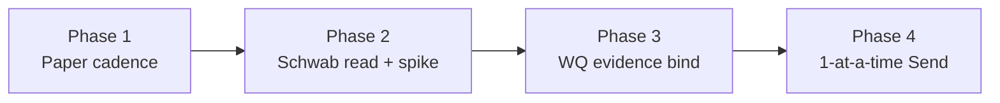

# Plan: Production-ready Winston Quiver (WQ)

**Status:** Accepted 2026-08-30 (operator: file phases + track; Phase 1 now, Phase 2 later today)  
**Date:** 2026-08-30  
**Series:** `production-ready-wq`  
**Monoliths:** winston_v2 (Wv2), broker_gateway (BG), ecosystem  
**Mode:** contractor (general contractor in `ecosystem/`; Wv2 ops + BG transport)  
**Replaces / succeeds:**
- Paper desk: [`wq-shadow-monday-plan.md`](wq-shadow-monday-plan.md) (Phase 1 still closes its tickets)
- Later BG fills: [`quiver-tracking-bg-fulfillment.md`](quiver-tracking-bg-fulfillment.md) — **superseded** by Phases 3–4 of this plan
**Does not replace:** [`trade-fulfillment-engine.md`](trade-fulfillment-engine.md) (L1 Confirmation Intake + L3 write law for the whole desk). This plan is the WQ-shaped path through that ladder.

**North star (Phase 4, not this week):** one-at-a-time Charles Schwab **Desk Send** (order entry) and **Desk Confirm** (book the fill) on a funded WQ real series. Not a 13-name basket auto-send. Not thinkorswim paperMoney as the API sandbox.

---

## 1. Why this plan exists

WQ paper code landed 2026-08-28–30 (paste → Monday Rebalance Plan → Plan Approve → dummy_sim next-open). Live Schwab write is **not** shipped. The next honest work is:

1. Human-verify the paper cadence (code is ahead of ops).
2. Answer whether Schwab has a usable Individual sandbox, then build the **read** adapter.
3. Bind a dedicated Schwab account as **evidence** (hand-placed fill → Confirmation Intake → Confirm).
4. Only then authorize one-at-a-time **write**.

Working backwards from Phase 4 without skipping 1–3 would put `place_order` on an unverified desk and a stub adapter.

---

## 2. Current state (verified 2026-08-30)

| Surface | State |
|---------|--------|
| WQ Shadow Portfolio | Wv2 **#1372** `qtrack-cls-pdf-v1`, paper, $2,000, Daily Analysis skipped, **0 lots / 0 journals** |
| Monday plan | **#8** `draft`, 13 enters, fill 2026-08-31 — **not Approved** |
| `broker_binding_id` on #1372 | **nil** — DummySimFills looks up the seeded dummy_sim binding at execute time |
| BG | Up `:3003`. `dummy_sim` binding `bnd_f1feaf2e361799fc3ecd610a` active |
| dummy_sim evidence | Two events from **2026-08-10** (auth heartbeat + canned SPY `exact`). **No WQ sandbox_fills** |
| `schwab_trader_api` | Registry **profile stub only** (`registered: false`). No adapter class, no OAuth, no secrets |
| Confirmation Intake | Empty (`trade_notifications=0`, no BG cursors). WQ Plan Approve **auto-books in Wv2**; dummy_sim evidence is a side write |
| Dual rail | Monday plan **and** leftover per-leg `add_book` tasks. Approving both can double-book |

**Staging meaning (locked):** Winston paper on `dummy_sim` **is** the sandbox. thinkorswim paperMoney is UI-only and is **not** the Trader API target. Schwab “sandbox” for Individual apps is **unverified** until Phase 2 spike.

---

## 3. Domain locks (do not re-open)

| Lock | Meaning |
|------|---------|
| WQ = tracking desk + one shadow OP | Not a fourth monolith. Not Mint / Trend Following (TF). |
| Paper #1372 stays paper | Funded Schwab WQ = **Capital Activation** of a **new real series** (ADR-006), new BG binding. Never promote paper in place. |
| Plan Approve is the WQ Human-Gated verb | Whole-package Approve / Reject / skip-line. After Approve, **paper** remaining legs auto-execute at next-open on dummy_sim (ADR-009 §11). |
| Live Schwab is **not** implied by Plan Approve | Auto-execute of the remaining package must **not** become a basket `place_order`. Phase 4 is one Send + one Confirm. |
| Confirm ≠ Send | **Desk Confirm** = book only. **Desk Send** = place Order Intent only. Booking still needs Confirm (or a later explicit accept-fill policy). |
| BG owns transport + evidence | OAuth, adapter, JSONL. Wv2 owns match / prefill / book / Plan Approve. No shared PG. Secrets never in Wv2. |
| L1 capabilities until Phase 4 ADR | `auth` + `order_read` + `txn_read`. `order_write: false` on every shipped binding. |
| Write ADR is **not** current ADR-010 | ADR-010 is Risk Scale Meta-Layer. Phase 4 drafts the **next free** fulfillment-write ADR. Older tickets that say “ADR-010 before `order_write`” mean that future ADR. |
| BG never talks to Quiver | Published book comes from operator paste / PDF. |
| Mint / TF Ops stay off this binding | Per-leg Human-Gated; no auto-send; no WQ Schwab credentials on those OPs. |

---

## 4. Phases

| Phase | Goal | Authorization | Human gate |
|-------|------|---------------|------------|
| **1** | Two clean dummy_sim Monday cycles; binding persisted; one desk path | **Now** | Operator Approve / blow-away on `/quiver_tracking` |
| **2** | Portal sandbox verdict + `schwab_trader_api` **read** adapter (fixtures → gated live read) | **Later today** (fixtures + spike). Live credentials = operator | Operator on developer.schwab.com; no write scopes |
| **3** | Thin OP↔binding; hand-placed Schwab fill → evidence → WQ Confirm | After 1–2 green | Capital Activation of a **new real** WQ series before live account bind |
| **4** | One-at-a-time Desk Send + Confirm | **Not authorized** until write ADR + 1–3 verified | Real-money Send click; kill switch |

Do not start Phase N+1 coding that assumes Phase N acceptance, except Phase 2 **fixtures** (no network) which may overlap Phase 1 wrap.

---

## 5. Phase 1 — Paper cadence (human-verify + glue)

**Ticket:** [`docs/tickets/2026-08-30-wq-phase1-paper-cadence-verify.md`](../docs/tickets/2026-08-30-wq-phase1-paper-cadence-verify.md)  
**Children:** `2026-08-28-wq-monday-rebalance-plan.md`, `2026-08-28-bg-dummy-sim-sandbox-fills.md`  
**Issues:** dual-path double-book; nil `broker_binding_id`

### 5.1 Outcome

The operator can run WQ as a weekly (or test-anytime) loop:

paste Holdings + Shorts → draft Monday plan → Approve (or Reject / skip-line) **locks the package** → Confirm tasks **one at a time** (Positions / current book grow per confirm) → HITL flag on names with no fill (e.g. BRK.B) without failing the plan → blow-away clears lots **and** Quiver targets → second cycle works. Flatten is the exclusive other mode, and only lists **open lots**.

### 5.2 Work

1. **Canonical path (operator lock 2026-08-30):** Monday plan **Approve** = lock. Tracking **tasks** = execute one at a time. Do **not** auto-book on Approve (that was why plan #8 filled Positions while 14 tasks remained).
2. Missing fill (BRK.B / missing parquet) is a **per-leg HITL flag**, not `plan.status=failed`.
3. **Persist** `#1372.broker_binding_id` = dummy_sim `bnd_f1feaf2e361799fc3ecd610a` (issue).
4. **Operator cycle A:** Blow away the auto-booked #8 residue → paste → Approve (buttons then disabled) → Confirm ready tasks one at a time. BRK.B stays HITL until a typed price or skip.
5. Current book = **open lots only**; Quiver Target clears on blow-away.
6. **Cycle B:** blow-away → paste → Approve → confirm again.
7. **Once:** flatten plan on a book that **has open lots**.
8. Close 2026-08-28 acceptance boxes only when the above is true on compose, not from specs alone.

### 5.3 Non-goals

Schwab OAuth, `place_order`, Confirmation Intake as the WQ booking spine (paper books on **task Confirm**), native Premium PDF parse.

---

## 6. Phase 2 — Schwab sandbox spike + L1 read adapter

**Ticket:** [`docs/tickets/2026-08-30-wq-phase2-schwab-read-and-sandbox.md`](../docs/tickets/2026-08-30-wq-phase2-schwab-read-and-sandbox.md)  
**Children:** `2026-08-07-schwab-trader-api-sandbox-spike.md`, `2026-08-09-bg-schwab-read-adapter-l1.md`

### 6.1 Outcome

A factual sandbox verdict in the landscape doc, and a BG adapter class `schwab_trader_api` that can authenticate and emit Winston Broker Evidence Standard events from **fixtures**. Live read is gated, write is still CapabilityGate-refused.

### 6.2 Work

1. **Spike (operator):** log into [developer.schwab.com](https://developer.schwab.com). Record environments for Individual Accounts and Trading; whether sandbox is selectable / synthetic-only / retail production-only; paperMoney ≠ API. Update landscape §7.3.
2. **Fixtures first:** canned Schwab order/txn JSON → evidence events (shared harness under `ecosystem/interfaces/fixtures/broker-evidence/`).
3. **Adapter class** in BG: `auth` + `order_read` + `txn_read`; `order_write: false`; `place_order` hard-disabled.
4. **OAuth/session in BG** (secrets pointer, never Wv2). Access ~30m / refresh ~7d is an **ops product** (re-auth attention).
5. **Live read** only after fixtures green **and** spike verdict. Default env: no live credentials. If production-only: dedicated small account, read scopes only, fail closed.

### 6.3 Non-goals

`place_order`, Desk Send, binding WQ #1372 to Schwab, IBKR, email as source of truth, paperMoney as API paper.

---

## 7. Phase 3 — Wire WQ to Schwab as evidence (not send)

**Ticket:** [`docs/tickets/2026-08-30-wq-phase3-wq-schwab-evidence-bind.md`](../docs/tickets/2026-08-30-wq-phase3-wq-schwab-evidence-bind.md)

### 7.1 Outcome

Thin Grill B Q8: Operational Portfolio ↔ BG binding is explicit. **Operator lock 2026-09-01:** paper-broker rehearsal uses **IBKR paper** `DUT070450` through `interactive_broker_trader_api` (same BG adapter class as a future live IBKR binding). Schwab remains the **real-series** north star; do not mix Mint/TF onto this binding.

Operator places **one** equity by hand on IBKR paper (or later Schwab); BG refresh produces evidence; Wv2 Confirmation Intake matches; human **Desk Confirm** books that one lot. **Confirm ≠ Send.** `place_order` still CapabilityGate-refused.

Paper #1372 stays **paper** (never promote in place). It may bind IBKR paper **read** for this rehearsal; `dummy_sim` remains the Winston-internal sandbox adapter.

### 7.2 Work

| OP | Binding |
|----|---------|
| Paper WQ #1372 | `interactive_broker_trader_api` paper (`env=sandbox`, DUT070450) for evidence rehearsal; `dummy_sim` still valid if unbound |
| Real WQ series (new, later) | `schwab_trader_api` or IBKR live binding, `order_write: false` until write ADR |

1. Persist / UI `broker_binding_id` (Q8 thin — not the full multi-OP-same-account design).
2. Confirmation Intake surfaces WQ (not only TF `/operations`).
3. Human proof: one hand-placed fill round-trip.
4. Kill switch / auth-failed is operator-visible on the WQ desk.

### 7.3 Non-goals

Desk Send, auto-send of the Monday basket, mixing Mint with this Schwab login, treating broker balances as `capital_base`.

---

## 8. Phase 4 — One-at-a-time order entry / confirmation

**Ticket:** [`docs/tickets/2026-08-30-wq-phase4-one-at-a-time-send.md`](../docs/tickets/2026-08-30-wq-phase4-one-at-a-time-send.md)  
**Blocked on:** Phases 1–3 green + **new fulfillment-write ADR** (next free id; not ADR-010).

### 8.1 Outcome

After Plan Approve on the **real** WQ series:

1. Remaining legs become a **send queue** (not auto `place_order`).
2. Operator **Desk Send** one name → BG `place_order`.
3. Fill evidence → Confirmation Intake.
4. Operator **Desk Confirm** books that lot.
5. Repeat. Skip-line still omits a name. Kill switch on.

### 8.2 Work (when authorized)

1. Grill + write ADR: Confirm ≠ Send, fail closed, paper never live write, WQ does not inherit paper auto-execute, G20 / audit, no Daily Analysis place.
2. CapabilityProfile `order_write` only on the real WQ Schwab binding, never on dummy_sim or paper #1372.
3. WQ-only Send UI / MCP verb. Mint / TF stay Confirm-only on their bindings.
4. Contract tests: refuse basket send; refuse write on L1 profile; idempotent `client_order_key`.

### 8.3 Non-goals

L4 autotrader, resting Turtle stops (separate ticket), IBKR as first write adapter, silent accept-fill without Confirm (unless the write ADR explicitly carves that later).

---

## 9. Ticket and issue index

### Epic

| File | Status |
|------|--------|
| [`docs/tickets/2026-08-30-production-ready-wq.md`](../docs/tickets/2026-08-30-production-ready-wq.md) | In progress |

### Phase tickets

| Phase | File | Status |
|-------|------|--------|
| 1 | [`2026-08-30-wq-phase1-paper-cadence-verify.md`](../docs/tickets/2026-08-30-wq-phase1-paper-cadence-verify.md) | In progress |
| 2 | [`2026-08-30-wq-phase2-schwab-read-and-sandbox.md`](../docs/tickets/2026-08-30-wq-phase2-schwab-read-and-sandbox.md) | Proposed |
| 3 | [`2026-08-30-wq-phase3-wq-schwab-evidence-bind.md`](../docs/tickets/2026-08-30-wq-phase3-wq-schwab-evidence-bind.md) | Proposed |
| 4 | [`2026-08-30-wq-phase4-one-at-a-time-send.md`](../docs/tickets/2026-08-30-wq-phase4-one-at-a-time-send.md) | Proposed — blocked |

### Issues (defects / known-wrong)

| File | Feeds |
|------|--------|
| [`docs/issues/2026-08-30-wq-dual-path-can-double-book.md`](../docs/issues/2026-08-30-wq-dual-path-can-double-book.md) | Phase 1 |
| [`docs/issues/2026-08-30-wq-shadow-op-nil-broker-binding.md`](../docs/issues/2026-08-30-wq-shadow-op-nil-broker-binding.md) | Phase 1 |

### Preexisting children (do not duplicate)

| File | Role now |
|------|----------|
| `2026-08-28-wq-monday-rebalance-plan.md` | Phase 1 — code landed; **acceptance still open** |
| `2026-08-28-bg-dummy-sim-sandbox-fills.md` | Phase 1 — code landed; **live events not yet proven** |
| `2026-08-07-schwab-trader-api-sandbox-spike.md` | Phase 2 child |
| `2026-08-09-bg-schwab-read-adapter-l1.md` | Phase 2 child |
| `2026-08-09-l1-confirmation-intake-bg-build.md` | Parallel L1 epic; Phase 3 consumes intake |
| `2026-08-21-quiver-tracking-bg-fulfillment.md` | **Superseded** by Phases 3–4 |

---

## 10. Explicit non-goals (whole plan)

- Turtle-from-PDF / Sandbox Autotrader / top-4 slim family (scrapped 2026-08-28)
- Native Premium PDF extraction (paste is the book; separate P2 ticket)
- Quiver scrape bot
- Daily Analysis on the tracking OP
- Shared PG Wv2↔BG
- Email confirmation as source of truth
- Mixing this Schwab login with Mint / TF Ops

---

## 11. Resume

- **Now:** Phase 1 ticket + two issues. Operator on `/quiver_tracking`.
- **Later today:** Phase 2 spike (operator portal) + Schwab read **fixtures** (no live write).
- **Not today:** Capital Activation, `place_order`, write ADR.
