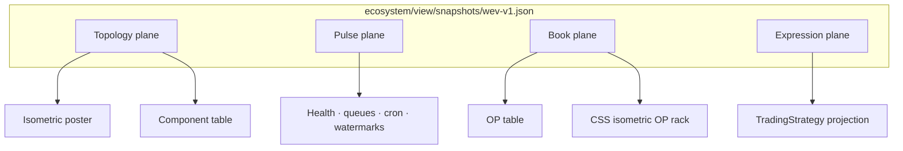

# Plan: Winston Ecosystem View — Candidate A (inventory-first thin projector)

> **Tournament record — not SoT.** Applied synthesis: `ecosystem/plans/winston-ecosystem-view.md`.

| Field | Value |
|-------|--------|
| **Status** | Tournament candidate A — **not applied** until a judge picks a winner |
| **Date** | 2026-09-07 |
| **Author** | Tournament Candidate A |
| **Type** | Cross-monolith operator surface (spec + projector). **Not** a 5th majestic monolith |
| **Mode** | tournament |
| **Graph nodes** | `ecosystem/`, `data_manager`, `winston_unit_test`, `winston_v2`, `broker_gateway`, `ai/` (Cromwell runtime — not a 5th monolith) |
| **Human gates** | No new compose service; no Wv2 business logic; no invented scores; Capital Activation remains unshipped |
| **Related** | `CONTEXT.md`, ADR-001, ADR-005, ADR-006, ADR-007, ADR-012, `plans/cromwell-staff-roster.md` (Pulse overlap only), inventories `/tmp/wev-inventory-*.md` |
| **Contracts** | `ecosystem/interfaces/winston-ecosystem-view-v1.md` |
| **Poster DSL** | `ecosystem/docs/poster/winston-topology.dsl.md` |

**Thesis (locked unless evidence kills it):** inventory scripts and JSON contracts in `ecosystem/` first; a static isometric poster regenerated from compose + interfaces; a static/light HTML console in `ecosystem/` that polls snapshot JSON; 2.5D OP rack is a later CSS projection of the **same** OP list as the 2D table; Wv2 donates **one header link**; Pulse reuses `EcosystemHealthCheckService` + Sidekiq Redis + `DataCoverage` and **never** merges into PnL. No new Rails app. No DragonRuby. No OpenTelemetry collector (none exists).

---

## 1. Why this view exists

Operators cannot currently see the Winston graph as one picture. Health is Telegram + Cromwell `/infra`. Topology is `bin/compose ps` plus a stale `ecosystem/deployment/compose.yml`. Operational Portfolios live in Wv2 ops-shell. Lab scores live in WUT. Queues have no SLO and no board. The brief asked for a “book board” and a “BookScore engine.” Those nouns are wrong (see §2). Candidate A ships a **projector**: it reads what already exists, stamps `UNKNOWN` on what does not, and never invents a fifth monolith or a composite PnL score.

This is the **Winston Ecosystem View (WEV)**. It is a GC product in `ecosystem/`, not a DM status page, not a Wv2 ops-shell tab that re-implements the graph, and not a game canvas.

---

## 2. Glossary mapping — brief → canonical

Every operator-facing string in WEV uses `CONTEXT.md`. The user-brief vocabulary is **translated**, never shipped.

| Brief / informal | Canonical (`CONTEXT.md`) | WEV rule |
|------------------|--------------------------|----------|
| “book” as a paper/live strategy slot | **Operational Portfolio (OP)** — a Wv2 `portfolios` row used for Daily Analysis and human tasking | Book board **world = list of OPs**. A Book is **not** a row on this board |
| Book | **Book** = Portfolio ↔ Market join (`books` table). Allocation slot, not an account | Poster and OP rack may list Book **symbols** as membership chips. Never label an OP “Book Red” |
| paper / live | **Execution Mode** `paper` \| `real` on the OP. Default `paper`. Independent of **Active** and `export_kind` | Enum is `paper` \| `real`. The string `live` is forbidden in contracts and UI |
| live portfolio / production portfolio | **Operational Portfolio** with `execution_mode=real` (capital intent) **or** merely an OP (paper is still execution) | Do not imply real money from Active, IBKR bind, or export_kind |
| promote paper → live in place | **Capital Activation**: new successor OP, same fingerprint, new initial **CashEvent** `$X`. Service **not shipped** (ticket `2026-07-09-capital-activation-mcp-telegram.md`). Closest code: `PortfolioSuccessorService` (shape rebalance) | No “Make live” chrome in v1. Project `successor_of_id` if present. Link to the CA ticket as UNKNOWN verb |
| BookScore engine | **Does not exist.** Scores that exist: WUT **PBR** (`total_return`, `max_drawdown`, `practical_sharpe_ratio`); WUT **PCS** (`corr_v2`, SoT); Wv2 ops equity series (`return_pct`, `max_drawdown_pct`, CAGR, Calmar); **Mid-Month Scoreboard** process scores 0–100 + per-OP period metrics; **DAR** `scored` \| `not_scored` | Contract name `BookScore` in the brief is implemented as **`ScoreProjection`**. UI MUST NOT invent a composite. Missing fields = `UNKNOWN` |
| expression_rev / modular expression pipeline | **TradingStrategy** + SHA256 **fingerprint** of canonical payload. Stages in the brief map to existing objects (universe = Books membership, features = Winston EOD parquet, signal = `StrategyRegistry` class names, filter = Confirmational Entry, sizer/risk = TS + PositionSizer, execution = Desk/BG, ledger = CashEvent + Journal) | Contract `ExpressionProjection` is a **view** of one TradingStrategy. No new engine. No `expression_rev` field |
| paper_live_hash_ok | **Does not exist.** Fingerprint is methodology identity, shared across paper and real series | Field status `UNKNOWN`, reason `fingerprint_is_methodology_not_paper_vs_real` |
| WUT owns paper books, Wv2 owns live books | **False.** Wv2 owns paper **and** real OPs. WUT `paper_runs` / `paper_orders` are lab replay of a PBR. WUT Quiver skim `quiver_lab_books` are not OPs | Book board = Wv2 OPs only. Optional lab appendix is a **different** plane/list, labeled WUT lab, not mixed into the OP rack |
| “component” / “service” as a 5th app | **Majestic monolith** (DM, WUT, Wv2) + **Broker Gateway** + optional **ai** profile. Cromwell is not a monolith | Poster groups 17 compose services under four monolith parents + `infra` + `ai` + **host** (IBKR CPGW). Do not draw Cromwell as a 5th building |
| Pulse / health as a PnL traffic light | **EcosystemHealthCheckService** probes + SessionCoverage + queues + cron last-run | Pulse plane never shows `return_pct`. Book plane never shows queue depth as “book health” |
| CodeCity / FossFLOW / DragonRuby / OTel / HDF5 / S3 | **Absent** from this repo | Do not mention as if present. Do not add until a collector / runtime exists |

**Three independent OP axes (ADR-006) — never collapsed:**

| Axis | Field | Meaning |
|------|-------|---------|
| Economic provenance | `export_kind` | `observation` \| `trade_ready` (WUT viability) |
| Attention | `active` | Daily Analysis + human task surface |
| Capital intent | `execution_mode` | `paper` \| `real` |

---

## 3. The four planes (never collapsed)

WEV is four **view planes** over one snapshot bundle. A plane is a question. Collapsing them produces the false “red because drawdown” dashboard the scorecard forbids.



| Plane | Operator question | Views on this plane | Contracts | Must not include |
|-------|-------------------|---------------------|-----------|------------------|
| **1. Topology** | What exists and how is it wired? | Isometric poster; nested-container table; edge list | `ComponentStatus` + poster DSL | Health colors as the only encoding; OP PnL; queue depth |
| **2. Pulse** | Is work moving? | Health cards; queue depths; cron last/next; data watermarks | `ComponentStatus.health`, `QueueSnapshot`, `CronSnapshot`, `DataWatermark` | `return_pct`, Sharpe, PCS, DAR Hold-as-success |
| **3. Book** | Which **Operational Portfolios** exist, paper vs real, with **existing** scores? | 2D table (v1); CSS 2.5D rack (same list) | `OperationalPortfolioRow` + `ScoreProjection` (brief: BookScore-as-projection) | Invented composite; treating Book join rows as the world; WUT paper_runs mixed in |
| **4. Expression** | What methodology is this fingerprint? | TS card: registry class names + fingerprint + which OPs apply it | `ExpressionProjection` | A new expression engine; `expression_rev`; mutating Engaged OPs |

**Plane discipline (normative):**

1. Pulse `degraded` is allowed while an Active real OP is green on return. That is correct.
2. Book-plane attention bands are ADR-006: Active real → Active paper → inactive. That is **not** a Pulse severity.
3. Expression plane is read-only. No “edit pipeline” chrome.
4. Topology poster stays generated from compose + this DSL, not hand-moved boxes that drift.

**Relation to Builder vs Desk (WORK_GRAPH / staff-roster):** those are *work* planes (how humans/agents ship). WEV’s four planes are *runtime/domain* views. Do not rename Topology to Builder. Staff-roster **DM `/status`** (not built) is a **Pulse-only** board; WEV may **link** to it. WEV is not implemented as DM `/status` — that would collapse four planes into the watchdog.

---

## 4. Eight operator deliverables

| # | Deliverable | Plane | v1 ship? |
|---|-------------|-------|----------|
| D1 | Canonical isometric **topology poster** (SVG/HTML) regenerated from compose + DSL | Topology | Yes |
| D2 | **Operator console** — static/light HTML in `ecosystem/view/`, poll/refresh snapshots, dark, 900px fold | Shell over all four | Yes |
| D3 | **Pulse board** — HTTP probes + compose/ps + gaps (BG not in watchdog) | Pulse | Yes |
| D4 | **Data watermarks** — DataCoverage, SessionCoverage vs `CompletedNySession`, Quiver, BG cursors | Pulse | Yes (project existing; UNKNOWN the rest) |
| D5 | **Queue + cron clocks** — four Redis DBs, Sidekiq-cron, Cromwell `jobs.json` | Pulse | Yes |
| D6 | **Book board 2D** — OP list, paper\|real same schema, projected scores | Book | Yes |
| D7 | **CSS isometric OP rack** — same JSON as D6, later visual | Book | v1: CSS slabs from the same list (not DragonRuby). Density polish is v1.1 |
| D8 | **Expression board** — TradingStrategy + fingerprint as a pipeline *projection* | Expression | Yes (read-only cards) |

Non-deliverables (rejected as v1): OTel traces, CodeCity hotspot city, HDF5 lake, S3, FossFLOW, Sidekiq Web mount, Capital Activation verb, DM `StatusController` rewrite, new Rails app, Wv2-hosted live console (Candidate B), DragonRuby 2.5D first (Candidate C).

---

## 5. Data contracts (summary)

Canonical schemas: [`ecosystem/interfaces/winston-ecosystem-view-v1.md`](../interfaces/winston-ecosystem-view-v1.md).

One snapshot envelope, six inner types. Inventory scripts write the envelope; the console only reads it.

| Type | What it is | Source of truth (already in repo) | Projector must not |
|------|------------|-----------------------------------|--------------------|
| **ComponentStatus** | One compose service, host process, or named volume | Root `compose.yml` (17 services); `bin/compose ps`; `EcosystemHealthCheckService::DEFAULT_PROBES`; IBKR CPGW is **host**, not a container | Invent a 5th monolith; treat `starting` (no healthcheck) as a hang without logs |
| **DataWatermark** | Freshness of one data product | `DataCoverage` (earliest, latest, bar_count, indicators_present, last_reconciled_at); `SessionCoverage` vs `CompletedNySession.date`; `QuiverSyncRun`; BG `evidence_cursors` + `adapter_bindings.last_event_seq`; Wv2 `BrokerGatewayCursor` | Invent parquet sidecar `asof` (specified, **not coded**); invent a roll calendar |
| **ScoreProjection** (brief: BookScore) | Existing score fields on one **OP**, tagged by source | PBR columns; PCS snapshot (`books_key`); `Operations::PortfolioEquitySeries` metrics; MMS `scores` + period metrics; DAR scored-session status | Composite PnL; `vol` / `expectancy` / `current_dd` / `signal_idle_bars` as if stored; keying PCS by fingerprint |
| **ExpressionProjection** | One **TradingStrategy** drawn as brief-stage columns | `trading_strategies` + `fingerprint` / `fingerprint_payload`; OP Books membership; `fulfillment_adapter_key` on applying OPs | New DAG engine; `expression_rev`; paper vs real hash |
| **QueueSnapshot** | One Sidekiq queue on one Redis DB | Redis `/0` DM, `/1` WUT, `/2` Wv2, `/3` BG; `LLEN queue:default`; `ZCARD retry` / `dead`; WUT `expected_returns` **producer-only** (consumer UNKNOWN) | Queue SLOs (none exist); a custom Redis list bus |
| **CronSnapshot** | One scheduled job | Monolith `config/sidekiq_schedule.yml`; Cromwell `ai/data/cromwell-bot/workspace/cron/jobs.json`; catalog `ecosystem/ai/schedule/manifest.yaml` (drift vs YAML is a Pulse finding) | Pretend catalogs are in sync; claim Sidekiq last-ok without reading Redis/cron gem |

**UNKNOWN policy (normative):** every projected field is `{ "status": "ok", "value": …, "source": "…" }` or `{ "status": "UNKNOWN", "value": null, "reason": "…" }`. Never coerce missing to `0`. Never hide a gap with a green check.

**Paper/real same schema (normative):** `OperationalPortfolioRow.execution_mode` is a field, not a type fork. `ScoreProjection` and rack slabs use the same object. CSS may color the chip (`paper` muted gold, `real` accent) but must not split APIs.

---

## 6. Architecture — thin projector, no new service

```
┌──────────────────────────────── ecosystem/ ─────────────────────────────────┐
│  interfaces/winston-ecosystem-view-v1.md     contracts                      │
│  docs/poster/winston-topology.dsl.md         poster DSL                     │
│  scripts/wev/*                               inventory + render (CLI)       │
│  view/index.html + css/js                    console (static)               │
│  view/snapshots/wev-v1.json                  generated, gitignored          │
│  view/poster/topology.svg                    generated                      │
└────────────┬────────────────────────┬───────────────────────┬───────────────┘
             │ reads                  │ reads                 │ one <a>
             ▼                        ▼                       ▼
     compose.yml + Redis      monolith internal        Wv2 ops-shell header
     + jobs.json + PG via     HTTP / rails runner      ops-btn ghost
     rails runner             (existing only)
```

**No new compose service. No new Rails app. No DragonRuby process. No OTel collector.**

### 6.1 Where code lives

| Path | Role |
|------|------|
| `ecosystem/scripts/wev/` | Inventory + assemble + render-poster. Ruby stdlib + `redis-cli` + `curl` + `bin/compose exec … rails runner` |
| `ecosystem/view/` | Static HTML/CSS/JS. First paint = last snapshot. Poll 30s |
| `ecosystem/view/snapshots/` | Generated JSON. Gitignore. Empty snapshot = explicit empty state (ADR-005) |
| `ecosystem/docs/poster/` | DSL source + generated SVG checked in when topology changes |
| `winston_v2/app/views/operations/home/index.html.erb` | **One** `<a class="ops-btn ghost">` (and the same on subpage headers only if we want reachability). No new route, no new controller, no Turbo |
| Monoliths | **No v1 controllers.** Optional later: additive fields on existing `GET /internal/portfolios` if runner dumps get painful — separate ticket, not this plan’s DoD |

### 6.2 How the console is opened (YAGNI)

| Option | Verdict |
|--------|---------|
| `python3 -m http.server 3040 --bind 127.0.0.1` from `ecosystem/view/` via `ecosystem/scripts/wev/serve` | **v1.** Operator convenience. **Not** a compose service. Documented in deployment README |
| `file://` | Reject for fetch/CORS |
| Wv2 Rails route rendering the console | Candidate B — rejected (couples the graph to Wv2 uptime; pulls Pulse next to desk PnL) |
| DM `GET /status` as the WEV host | Staff-roster Pulse board (controller **missing**). Link later; do not wait; do not collapse planes |
| New `wev` container | Invented service — forbidden |
| Tailscale Serve `/wev` | **UNKNOWN** / follow-on. Ticket sibling of `2026-07-04-tailscale-serve-ecosystem-deployment.md`. Do not block v1 |

Wv2 header href: `ENV.fetch("WEV_CONSOLE_URL", "http://127.0.0.1:3040/")`. If serve is down the link fails honestly. Chat auto-link regex does **not** need `/wev` (the control plane is not this view).

### 6.3 Reuse, not rewrite

| Need | Reuse |
|------|--------|
| HTTP liveness | `EcosystemHealthCheckService::DEFAULT_PROBES` (DM, WUT, Wv2, MCP, ollama, nanobot). **BG is not in the list** — project `not_probed` until staff-roster PR 1a. Inventory may *also* `GET http://127.0.0.1:3003/health` as a declared extension of the same probe shape, not a parallel watchdog |
| Persist last health | Planned `data_manager/storage/ecosystem_health/last.json` — **not written today**. WEV writes its own snapshot. When `last.json` lands, Pulse **prefers** it and stops re-probing on the inventory run if fresh |
| Coverage | `DataCoverage` + `SessionCoverage.stale_among` + `CompletedNySession.date` |
| Queues | Redis `LLEN` / `ZCARD` on DBs 0–3. No Sidekiq::Web mount |
| Cromwell clocks | `ai/data/cromwell-bot/workspace/cron/jobs.json` (`lastRunAtMs`, `lastStatus`, `lastError`, `durationMs`, `nextRunAtMs`) |
| OP list | Wv2 `Portfolio` via rails runner (internal `GET /internal/portfolios` is too thin today: no `execution_mode` / fingerprint) |
| PCS | Wv2 `portfolio_correlation_snapshots` keyed by `books_key` (ADR-007). Do not recompute |
| Ops equity | `Operations::PortfolioEquitySeries` **inside the inventory CLI**, never on the HTML request path |
| Theme / mobile | Copy Wv2 `ops_shell.css` tokens (`--ops-bg`, `--ops-ok`, 900px fold, `100dvh`, `env(safe-area-inset-top)`). No Turbo/Stimulus (Wv2 does not use them) |

---

## 7. Poster DSL sketch

Full sketch: [`ecosystem/docs/poster/winston-topology.dsl.md`](../docs/poster/winston-topology.dsl.md).

Design: a small YAML **iso-topology** file checked in next to the renderer. It is **not** FossFLOW, Structurizr, or PlantUML (none exist here). It is diagram-as-code for *this* stack.

**Normative contents:**

- Four **monolith buildings**: `dm`, `wut`, `wv2`, `bg`
- Nested **process slabs** per building: `web`, `sidekiq`, `postgres`
- **Infra strip**: shared `redis` (DB 0/1/2/3 labeled), named volumes `sawtooth_dm_data`, `sawtooth_bg_evidence`
- **ai wing** (`profiles: ["ai"]`): `ollama`, `open-webui`, `winston_mcp`, `nanobot_cromwell` — dashed / dimmed when profile down
- **Host dock** (not a container): IBKR Client Portal Gateway `https://localhost:5000`; Tailscale Serve note
- **Vendor clouds** (not containers): EODHD (env_file), Telegram (watchdog.env), Quiver (**not** in compose — `not_mounted`), Schwab (**not** in compose)
- **Edges** only if they exist in compose env, volume mounts, or an `ecosystem/interfaces/` contract. No pretty-fiction arrows

Renderer: `ecosystem/scripts/wev/render-poster` reads DSL + live `ComponentStatus` (for `starting`/`healthy` badges on the **Pulse overlay**, which is a **separate SVG layer** so topology ink never becomes a health heatmap).

---

## 8. Book board projection notes

**World = list of Operational Portfolios + projected scores.**

### 8.1 Row identity

| Field | Source | Notes |
|-------|--------|-------|
| `id` | `portfolios.id` | Wv2 |
| `name` | `portfolios.name` | Includes short fingerprint suffix when present |
| `seed_name` | column | Mutex key |
| `fingerprint` | column | Methodology identity; shared paper/real |
| `execution_mode` | `paper` \| `real` | Never `live` |
| `active` | boolean | Attention, not money |
| `export_kind` | `observation` \| `trade_ready` \| null | null → treat as observation (ADR-006) |
| `engaged` | `journals.exists?` | Shape lock |
| `closed_at` | column | Closed ≠ deleted |
| `successor_of_id` | column | Lineage; CA not shipped |
| `books` | sorted trading symbols | Membership; PCS join key |
| `trading_strategy_id` | FK | Expression plane join |
| `fulfillment_adapter_key` | column | dummy_sim / manual / schwab / ibkr |
| `broker_binding_id` | column | Fulfillment label, not Capital Authority |
| `wut_backtest_run_id` | column | Optional PBR link |
| `color` | presentation | Chart only |

**Attention sort (DAR/ops):** Active+real, Active+paper, inactive open, closed (collapsed by default).

**Out of this list:** WUT lab `portfolios`, WUT `paper_runs`, WUT `quiver_lab_books`, DAR “open book” lots table, legacy `winston/`.

WQ Shadow is **one paper OP** (`quiver_tracking` recipe). It stays on the board with a chip `wq_shadow`. Daily Analysis skip is a flag, not a second world.

### 8.2 Score projection (no engine)

For each OP, attach `ScoreProjection` with **named existing fields only**:

| Slot | Present? | Source | First-paint? |
|------|----------|--------|--------------|
| `ops.return_pct` | Yes, if series computed | `Operations::PortfolioEquitySeries` | Inventory CLI; UNKNOWN if timeout |
| `ops.max_drawdown_pct` | Yes | same | same |
| `ops.cagr_pct` / `ops.calmar` | Yes | `Operations::CagrCalmar` | same |
| `ops.end_equity` / `ops.initial_capital` | Yes | same | same |
| `pcs.score` | Yes, if snapshot | Wv2 copy of WUT SoT, `books_key` + `corr_v2` | Cheap SQL — v1 |
| `pcs.max_abs_correlation` | Yes | snapshot | v1 |
| `pbr.total_return` / `max_drawdown` / `practical_sharpe_ratio` | If `wut_backtest_run_id` | WUT `portfolio_backtest_runs` | Optional; UNKNOWN if WUT down |
| `mms.process_score` | If a mid_month_scoreboards row | process 0–100, **not** returns | Latest row or UNKNOWN |
| `mms.period.return_pct` etc. | If payload has per-OP period | MMS builder | UNKNOWN if no row |
| `dar.session_status` | If DAR JSON exists | `scored` \| `not_scored` — not a numeric DAR score | File read |
| `vol` | **No column** | — | UNKNOWN |
| `expectancy` | Lab MER stack only | Not on OP | UNKNOWN on this board |
| `current_dd` | Not stored | Derivable from series | UNKNOWN until series exists |
| `signal_idle_bars` | Not found | — | UNKNOWN |
| `paper_live_hash_ok` | Not found | — | UNKNOWN |
| `expression_rev` | Not found | — | UNKNOWN |

**UI:** one table. Columns that are UNKNOWN render the literal token `UNKNOWN` (muted), never `—` that looks like zero. No sparkline that averages Pulse+PnL.

### 8.3 2.5D rack = same list

v1 CSS: each OP is a **slab** on a board (one row of cards with isometric `transform: rotateX(60deg) rotateZ(-45deg)` on a wrapper). Data binding: `data-op-id`, `data-execution-mode`, `data-active`. Clicking a slab highlights the same id in the 2D table.

v1 **does not** build a city, a CodeCity metric extrusion, or a DragonRuby canvas. Height of a slab may encode **Active** (taller) vs inactive (flat) — **not** return%. Extruding PnL would collapse Book into a fake Pulse.

Below 900px: drop the 3D transform; stack slabs as the 2D cards already shown (one DOM list, two CSS presentations).

---

## 9. Expression as projection (not a new engine)

Brief stages → actual objects (inventory §3). The Expression board is a **table of TradingStrategy rows** plus a detail card.

| Brief stage | Projected field | Owner |
|-------------|-----------------|-------|
| universe | `books_symbols` of OPs that apply this TS (ops); WUT market catalogs are lab-only and labeled as such | Wv2 Books; WUT catalogs **not** mixed in as if they were OP universe |
| features | `parquet_standard: winston-eod-v0.1` + `indicators_present` union from DataCoverage of those symbols | DM |
| signal | `primary_entry_strategy` (StrategyRegistry class name) | TS |
| filter | `confirmational_entry_strategy_names` | TS / ADR-008 |
| sizer | `risk_evaluation_strategy`, `atr_multiplier`, `pyramid_atr_multiplier`, `max_pyramid` | TS; runtime `Operations::PositionSizer` is not a separate stored graph |
| risk | `risk_evaluation_strategy`, fingerprint_payload `risk_scale_policy` when ≠ none | TS / ADR-010 |
| execution | Distinct `fulfillment_adapter_key` values among applying OPs | OP, not TS |
| ledger | Not on TS. Link: “ledger lives on OP CashEvent + Journal” | Wv2 |

Identity: `fingerprint` (SHA256). Display: `name` + short suffix. `expression_rev` is **not** emitted.

Paper vs real: the **same** ExpressionProjection is linked from both a paper OP and its real successor. That is the point of fingerprint law (ADR-006).

---

## 10. Backlog — inventory scripts first

Chrome is forbidden until scripts emit valid `wev-v1.json` from the live stack.

### 10.1 Script set (`ecosystem/scripts/wev/`)

| Script | Writes | How (no new daemons) |
|--------|--------|----------------------|
| `inventory-compose` | `components[]` | Parse root `compose.yml` (Psych). Attach parent monolith. Flag `ecosystem/deployment/compose.yml` as **non-canonical** in `drift[]` |
| `inventory-ps` | overlay status | `bin/compose ps --format json` if available, else parse `ps`. Map “starting” + no healthcheck → `status: starting_no_healthcheck` |
| `inventory-health` | probe results | Prefer DM `last.json` if present and fresh. Else replay `DEFAULT_PROBES` from the host (`localhost:3001` etc.). Extra: BG `/health` as `extension_probes` |
| `inventory-queues` | `QueueSnapshot[]` | `redis-cli` `LLEN queue:default` `ZCARD retry` `ZCARD dead` `ZCARD schedule` on DBs 0–3. WUT: also `LLEN queue:expected_returns` |
| `inventory-cron` | `CronSnapshot[]` | (1) Parse each monolith `config/sidekiq_schedule.yml`. (2) `rails runner` `Sidekiq::Cron::Job.all` for last enqueue if Redis has it. (3) Read Cromwell `jobs.json`. (4) Diff vs `ecosystem/ai/schedule/manifest.yaml` → `catalog_drift[]` |
| `inventory-watermarks` | `DataWatermark[]` | DM rails runner: DataCoverage summary + SessionCoverage.stale_among(active union) + latest QuiverSyncRun. BG runner: evidence_cursors. Host: parquet `asof` → UNKNOWN |
| `inventory-ops` | OP rows + ScoreProjection | Wv2 rails runner: Portfolio columns + books symbols + engaged? + latest PCS by books_key + latest DAR file status. Equity series with a hard timeout (e.g. 20s total); overflow → UNKNOWN |
| `inventory-expressions` | ExpressionProjection[] | Wv2 (and optionally WUT) TradingStrategy rows + applying OP ids |
| `render-poster` | `view/poster/topology.svg` | DSL + ComponentStatus |
| `assemble` | `view/snapshots/wev-v1.json` | Concat + schema_version + generated_at (America/Denver + UTC) |
| `serve` | — | `python3 -m http.server` 127.0.0.1:3040 |

Wrapper: `ecosystem/scripts/wev/wev refresh` runs inventory → assemble → render-poster.

**DoD for “scripts first”:** `wev refresh` on the operator host produces a JSON file that validates against the interface examples, including at least one `UNKNOWN` field (proves we did not fake completeness).

### 10.2 Explicitly later

- Persist `last.json` inside `EcosystemHealthCheckService` (staff-roster PR 1a) — WEV consumes, does not own
- Additive `GET /internal/portfolios` fields (`execution_mode`, `fingerprint`, `seed_name`)
- BG probe added to `DEFAULT_PROBES`
- Tailscale Serve `/wev`
- Capital Activation chrome
- Queue SLOs (none to project)
- Host crontab for `wev refresh` every 60s — optional; v1 is operator-run + a documented `watch -n 60`

---

## 11. Reactive + mobile (ADR-005)

ADR-005: snappy first paint; heavy work off the request path; progressive fill. Wv2 ops-shell already does this with **fetch + innerHTML**, not Turbo (gems unused). WEV copies that pattern.

| Rule | WEV implementation |
|------|--------------------|
| First paint < 1s | `index.html` is static. Renders shell + last snapshot from `snapshots/wev-v1.json`. If missing: empty state “run `wev refresh`” — not a spinner forever |
| Heavy work | Inventory CLI / existing Sidekiq. Console never calls parquet loaders, PBR, or full journal graphs |
| Progressive | 30s `fetch` of the snapshot while `document.visibilityState === 'visible'`. Manual Refresh button (same as ops-shell) |
| No SPA framework | One `wev.js` IIFE. No importmap, no Stimulus, no Turbo, no websocket |
| Dark desk | Copy `--ops-*` tokens. `color-scheme: dark` |
| Mobile fold | `@media (max-width: 900px)` — plane switcher becomes `<details>`; table becomes stacked definition lists; isometric rack disables 3D transform; `100dvh`; `env(safe-area-inset-top)` |
| Reduced motion | `@media (prefers-reduced-motion: reduce)` — no rack tilt |
| First paint metadata | Topology counts, Pulse summary (`ok/degraded/UNKNOWN`), OP counts by band, TS count. Score columns fill from snapshot; they are already computed |

**Not Hotwire:** ADR-005 names Hotwire as *an* acceptable progressive tool. Wv2 does not use it. WEV matching Wv2’s fetch pattern is more consistent than introducing Stimulus here.

---

## 12. Pulse ≠ PnL

Normative split:

| Pulse (work moving) | Book (capital / regime heuristic) |
|---------------------|-----------------------------------|
| HTTP 200/302 probes | `return_pct`, max DD, CAGR, Calmar |
| Redis queue depth / retry / dead | practical_sharpe (PBR) |
| Cron last/next / Cromwell lastError | PCS 0–100 |
| DataCoverage.latest vs CompletedNySession | MMS process score (operating grade — still not Pulse) |
| BG `/health`, binding `last_auth_at` | DAR `scored` \| `not_scored` |
| Compose `starting` without healthcheck | export_kind / viability |

MMS **process_fidelity** is an operating grade, not ecosystem health. It lives on the Book plane (or a Book-plane “ops grade” column), never as a Pulse card.

Watchdog Telegram remains the interrupt channel (Principle 12). WEV does not double-page.

---

## 13. PR plan

Each PR is independently demoable. Merge order is the product.

| PR | Title | Tree | DoD |
|----|-------|------|-----|
| **PR-0** | Contracts + this plan + poster DSL (no runtime chrome) | `ecosystem/plans/`, `ecosystem/interfaces/winston-ecosystem-view-v1.md`, `ecosystem/docs/poster/winston-topology.dsl.md` | Files exist; glossary uses paper\|real; UNKNOWN list present. **This tournament output.** |
| **PR-1** | Inventory scripts + `wev refresh` | `ecosystem/scripts/wev/`, gitignore snapshots | Running stack → valid `wev-v1.json`. Includes BG `not_probed`, `expected_returns` depth, cron catalog_drift, at least one UNKNOWN score slot |
| **PR-2** | Poster renderer | `render-poster` + `view/poster/topology.svg` | SVG shows 4 monoliths, nested web/sidekiq/pg, redis DBs, parquet + evidence volumes, ai wing, host IBKR. Edges ⊆ compose/interfaces |
| **PR-3** | Static console: Pulse + 2D Book table + Expression cards | `ecosystem/view/` | Mobile 900px; empty snapshot state; Pulse cards have no return%; OP table paper\|real chips; UNKNOWN token visible |
| **PR-4** | CSS isometric rack bound to the same OP array | `view/css/rack.css` | One JS list; two presentations; no 3D on mobile / reduced-motion |
| **PR-5** | Wv2 link injection | `operations/home/index.html.erb` header `ops-btn ghost` + `onclick=stopPropagation`. Optional copy on fulfillment/DAR headers | No new route. Href `WEV_CONSOLE_URL` |
| **PR-6** (follow-on, not v1 DoD) | Consume staff-roster `last.json` when written; optional additive internal portfolio fields; Tailscale `/wev` ticket | DM / Wv2 as needed | Still no new compose service |

**Verify:** `wev refresh && python3 -m json.tool ecosystem/view/snapshots/wev-v1.json >/dev/null`. Open console at 3040. Confirm Wv2 ops-shell still first-paints (link is static).

**Rollback:** delete `ecosystem/view` + scripts; revert the one ERB line. Monoliths unchanged.

---

## 14. Key decisions

| Decision | Choice | Why |
|----------|--------|-----|
| K1 | Projector in `ecosystem/`, not a Rails app | ADR-001: ecosystem is GC. A 5th app would own nothing that is not already owned |
| K2 | Inventory CLI before chrome | Scorecard + ADR-005: you cannot paint what you have not measured. Scripts are the SoT for “what exists” |
| K3 | Static HTML + poll JSON | Matches Wv2 ops-shell (no Turbo). Works with AI profile down. First paint = disk |
| K4 | Four planes in one snapshot file, separate UI regions | Prevents Pulse←PnL collapse while keeping one refresh |
| K5 | Book world = OPs; Book join is membership | CONTEXT.md. Brief was wrong |
| K6 | `execution_mode` paper\|real; same schema | ADR-006. No `live` |
| K7 | ScoreProjection, not BookScore engine | Those engines do not exist. Inventing one would fight ADR-007 (PCS SoT in WUT) and cook a vanity composite |
| K8 | ExpressionProjection of TradingStrategy | Fingerprint law. No expression_rev |
| K9 | CSS isometric rack, same list as 2D | Delivers 2.5D without DragonRuby / fixed 1280×720 (conflicts ADR-005 fluid pages) |
| K10 | Wv2 change = one link | Operator already lives in ops-shell; the graph must remain visible if Wv2 is the thing that is down |
| K11 | Pulse reuses watchdog probes + Redis + DataCoverage | Staff-roster already chose this SoT. Do not fork a second probe list as authority |
| K12 | No OTel / CodeCity / HDF5 / S3 | Not in inventory. Adding them is fiction |
| K13 | Serve on 127.0.0.1:3040 via stdlib http.server | Not a compose service. Honest about host-only v1 |
| K14 | `UNKNOWN` is a first-class status | Completeness theater is how brief BookScore would ship |

---

## 15. Rejected alternatives

| Alt | Rejected because |
|-----|------------------|
| **B. Wv2-hosted live console** (new `/operations/ecosystem` ERB, panels JSON, possibly Hotwire) | Couples the ecosystem picture to Wv2 Puma. Staff-roster already rejected “WUT-only board” for the same reason. Mixes Pulse with desk PnL in the ops-shell. Requires Rails routes/controllers — more than a link. First paint risk if it queries four DBs. Violates “code in ecosystem/; Wv2 only a link” |
| **C. DragonRuby 2.5D first** | DragonRuby **not in repo**. Fixed canvas fights ADR-005 900px fluid + `100dvh`. Inverts inventory-first (chrome before scripts). Second UI stack (game runtime) beside ERB/Tailwind. OP rack would become a new world model, not a CSS view of the same JSON |
| DM `/status` as WEV | Controller missing; board is Pulse-only by design; DM should not query Wv2 OP ledgers on page load |
| Mount Sidekiq::Web × 4 | Auth surface, not a graph; still no watermarks/OPs |
| New compose `wev` service | Invented 18th container |
| Mermaid-only poster | WORK_GRAPH already has mermaid; operators asked for an isometric **poster**. Mermaid remains a source comment, not the shippable artifact |
| WebSocket / Action Cable live pulses | WUT Cable exists on Redis/1; Wv2 ops-shell does not. Polling 30s is enough; no new channel |
| Composite “book health” = f(return, PCS, queue, coverage) | Explicitly forbidden. Collapses four planes |
| In-place paper→real toggle | ADR-006 Capital Activation is successor OP; service not shipped |
| OTel collector “while we’re here” | No collector, no gems, no traces. Pulse is HTTP + Redis + PG metadata |
| Using stale `ecosystem/deployment/compose.yml` as topology | Inventory: **not canonical** (DM+WUT only, ports swapped) |

---

## 16. UNKNOWN list

Carry these into the snapshot as structured UNKNOWN — do not paper over.

**Runtime / topology**

- Built image tags (`image:` absent on Rails/MCP/nanobot builds)
- Whether IBKR CPGW is running **now** (host process; not in `podman ps`)
- Tailscale Serve path for a future `/wev`
- Resource limits (none declared)
- Whether live Rails `starting` is a hang vs missing healthcheck (needs inspect/logs)

**Pulse / queues / cron**

- Live Sidekiq last-ok / duration / next fire until Redis cron keys are actually read (script may still UNKNOWN if gem fields nil)
- Last error **class** for Sidekiq (not stored)
- Queue depth/age **SLOs** (none)
- Whether `winston_unit_test_sidekiq` consumes `expected_returns`
- Whether host crontab runs `paper_trading:daily`
- `ibkr_tickle` timezone (cron string has no `America/Denver` suffix)
- `EcosystemHealthCheckService` `last.json` (planned, not written)
- Watchdog does not probe BG, Schwab, Quiver — project `not_probed`
- DM `GET /status` controller missing
- Catalog drift: `sidekiq.yaml` / `manifest.yaml` missing wv2 `mid_month_scoreboard`, `confirmation_intake`, BG `ibkr_tickle`; duplicate `quiver_lab_friday_book`

**Data watermarks**

- Parquet embedded `asof` sidecar (standard text, not implemented in DM Ruby)
- Futures/options **roll calendar** (absent)
- Corporate-action clock (incidental on acquire; rake not scheduled)
- Holiday calendar out of scope (`CompletedNySession`)
- Quiver env **not mounted** in canonical compose

**Book / scores / expression**

- `vol`, `expectancy` (OP), `current_dd` (stored), `signal_idle_bars`, `paper_live_hash_ok`, `expression_rev` — do not exist
- Capital Activation service / MCP / ops-shell verb — not shipped
- Slate Automation column/code — not found
- `GET /internal/portfolios` omits `execution_mode` and fingerprint (runner compensates)
- Equity series on the inventory CLI may timeout → UNKNOWN
- PBR link only if `wut_backtest_run_id` set
- WUT paper ≠ Wv2 paper (must not UNKNOWN this — it is a known split, labeled)

**UI / obs**

- OpenTelemetry in Winston monoliths: absent
- CodeCity / CodeScene / FossFLOW: absent
- DragonRuby: absent
- How off-host operators reach `:3040` without Tailscale Serve: UNKNOWN (v1 is on-box)

---

## 17. Risks

| Risk | Mitigation |
|------|------------|
| Rails runner dumps are slow / lock Puma | Run in `compose exec` one-shot; equity timeout; never on GET |
| Snapshot stale while console looks “live” | Show `generated_at` + age chip; Pulse `stale` if age > 90s |
| Operator treats UNKNOWN as a bug in WEV | Copy: “UNKNOWN means the monolith does not store this” |
| Duplicate health vs Telegram | WEV is pull; watchdog stays interrupt SoT |
| Poster drift from compose | `inventory-compose` fails CI/demo if DSL nodes ⊈ compose service names (+ host/vendor extras explicitly typed) |
| Someone adds a Wv2 route “to help” | PR-5 is link-only; reject extra controllers in review |
| 2.5D CSS unreadability | Mobile: 2D only; rack is optional enhancement of the same list |
| `python http.server` forgotten | Empty-state copy names the exact command; Wv2 link 404 is acceptable v1 |

---

## 18. Why Candidate A wins this scorecard

1. **Glossary fidelity** — OP vs Book, paper\|real, CA as successor, PCS/PBR/MMS/DAR as themselves.
2. **Zero invented services** — 17 compose services + host CPGW; serve is stdlib on loopback.
3. **Four planes never collapsed** — separate UI regions, Pulse ≠ PnL, Expression ≠ Book.
4. **Inventory scripts before chrome** — PR-1 is the first runtime PR.
5. **Code in ecosystem/; Wv2 only a link** — one `ops-btn`.
6. **Reactive + mobile** — static first paint, 30s poll, 900px fold, ops-shell tokens.
7. **Pulse ≠ PnL** — watchdog + Redis + DataCoverage vs equity/PCS.
8. **Paper/real same schema** — one OP row type.
9. **YAGNI** — eight deliverables with CLI + static HTML + CSS, not a city engine.
10. **Expression as projection** — TradingStrategy + fingerprint, no new DAG.

---

## 19. Implementation notes (non-normative, for the winning contractor)

Suggested `wev-v1.json` top-level keys: `schema_version`, `generated_at`, `generated_at_mt`, `planes.topology`, `planes.pulse`, `planes.book`, `planes.expression`, `unknowns[]`, `drift[]`.

Gitignore: `ecosystem/view/snapshots/*.json` except `empty.example.json`.

Do not use `ecosystem/deployment/compose.yml`. Do not grep `attic/openclawd-stack` into the poster. Do not include `eta-service-2.0`.

Operator copy (first use): expand “OP” → Operational Portfolio, “PCS” → Portfolio Correlation Score, “DAR” → Daily Activity Report, “PBR” → Portfolio Backtest Run (`operator-prose` skill).
