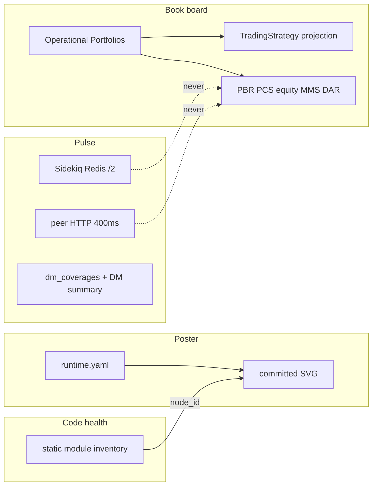

# Winston Ecosystem View — Candidate B (Wv2 ops-shell console)

> **Tournament record — not SoT.** Applied synthesis: `ecosystem/plans/winston-ecosystem-view.md`.

| Field | Value |
|-------|--------|
| **Status** | Draft — tournament Candidate B |
| **Date** | 2026-09-07 |
| **Author** | Architecture (Candidate B) |
| **Type** | Cross-monolith design |
| **Mode** | compete (isolation: this tree only) |
| **Graph nodes** | `ecosystem/`, `winston_v2` (view code), `data_manager`, `winston_unit_test`, `broker_gateway` |
| **Human gates** | None for v1 (read-only console). No Desk Confirm, no Capital Activation, no Engaged OP mutation. |
| **Related** | ADR-001, ADR-005, ADR-006, ADR-007, ADR-009, ADR-012; inventories `/tmp/wev-inventory-*.md`; `ecosystem/ecosystem_view/`; `interfaces/winston-ecosystem-view-v1.md`; `docs/poster/winston-topology.dsl.md` |

---

## Thesis (locked unless evidence kills it)

**Four-plane operator console, hosted in the Wv2 ops-shell**, because the human already lives at `/operations` (Tailscale `https://sawtooth-ai.tail944ffb.ts.net/wv2`).

Same dark `ops_shell.css` tokens. Same 900px mobile folds. Same `localStorage` fold keys. Same progressive-enhancement style (inline `fetch`, **no Turbo** — gems unused).

```
ecosystem/          contracts, poster DSL/SVG, inventory CLI, static catalogs
winston_v2          ERB + presenters + routes under /operations/ecosystem
compose.yml         unchanged (no new service, no docker.sock, no extra volume)
```

This is **not** a fifth monolith. AI remains a compose profile, not a plane owner.

---

## Why the console belongs in Wv2 (vs A static projector, vs C DragonRuby)

### Operator path is already Wv2

The operator’s daily surface is the ops-shell: chat = control, panels = truth, DARs, MMS, fulfillment, intake, Quiver Tracking. All share `ops-shell` / `ops-dars-page` and the 900px `<details>` fold. A second origin (static `ecosystem/` site, or a 1280×720 game canvas) is a **second desk**. Candidate B adds one ghost button next to “Quiver Tracking” / “All adapters” and one page that reuses the chrome the operator already has in muscle memory.

### Book board cannot be honest without Wv2 PG

Slabs are **Operational Portfolios** (`winston_v2.portfolios` + `books` + `trading_strategies`). Paper and real are the same row type (`execution_mode`). A static projector must either (a) call Wv2 anyway, or (b) go stale. Hosting the view where the SoT lives avoids a fake cache.

### Pulse that the phone can see

Off-LAN the operator hits Tailscale `/wv2`. DM `:3001`, WUT `:3000`, BG `:3003` are **not** on that Serve path. Browser JS cannot probe peers. Probes must originate **inside the compose network** — which Wv2 already has (`DATA_MANAGER_URL`, `WUT_INTERNAL_URL`, `BROKER_GATEWAY_URL`). A static file on disk cannot.

### What stays out of Wv2 (A’s real strength, kept)

Host-visible facts (`podman ps`, Redis `/0../3`, compose drift) are **not** available inside the `winston_v2` container without mounting the engine socket (invented coupling). Candidate B **does not** do that. Those facts stay in `ecosystem/ecosystem_view/bin/inventory` (already exists). When Wv2 is down, the CLI + committed poster still work. When Wv2 is up, the human does not leave `/operations`.

### DragonRuby (C) is absent

Inventory: **zero** `DragonRuby` / `dragonruby` hits; no 1280×720 target. Wv2 is fluid CSS with a 900px fold. A game runtime is a new deployable, a new input model, and a YAGNI violation. 2.5D isometric is **CSS** (`rotateX` / `rotateZ`) on the same JSON as the table toggle.

---

## Glossary (normative — do not contradict)

Canonical: `ecosystem/CONTEXT.md`. Inventories: `/tmp/wev-inventory-*.md`.

| Term | Meaning here | Avoid |
|------|----------------|--------|
| **Book** | Portfolio ↔ Market join row. Not a slab. Not paper/live. | “book as strategy slot” |
| **Operational Portfolio (OP)** | Wv2 `portfolios` row used for Daily Analysis / desk. **The slab.** | live portfolio, WUT lab portfolio |
| **Execution Mode** | `paper` \| `real` on the OP. Not `live`. Independent of Active and `export_kind`. | deriving mode from Active |
| **Active** | Attention / DA inclusion. Multi-Active paper+real is intentional (ADR-006). | sole-focus OP |
| **TradingStrategy** | Reusable methodology (fingerprint SHA256 of canonical payload). Not a modular expression DAG. | BookScore, expression_rev |
| **PCS** | Portfolio Correlation Score. WUT SoT; Wv2 copy keyed by **Books membership** (ADR-007). | TS performance metric |
| **PBR** | WUT `portfolio_backtest_runs`. Lab score, not ops equity. | treating ops equity as a PBR |
| **DAR** | Document of a Scored Session (`scored` \| `not_scored`). Not a numeric “DAR score”. | DAR score vector |
| **MMS** | Mid-month scoreboard operating scores 0–100 (process), plus per-OP period metrics. | folding MMS into Pulse |
| **Pulse** | Process / queue / cron / HTTP / DataCoverage health. **Not PnL.** | return_pct on Pulse |
| **Poster** | Committed topology drawing. Nodes = compose + host + vendors. | live `ps` as the poster |
| **Code health** | Static file/LOC inventory mapped to poster node ids. No CodeScene. | CodeCity, hotspot ranks |
| **Book board** | OP rack + table. Same JSON. Paper and real **same schema**. | WUT `paper_runs` as OPs |
| **UNKNOWN** | Field not observed this paint. Never guessed. Fail closed. | empty string meaning ok |

**BookScore engine does not exist.** Do not invent `ret/vol/sharpe` as a Book vector, `expression_rev`, or `paper_live_hash_ok`. Project **PBR / PCS / ops equity / MMS / DAR status** onto the OP.

**AI layer is not a fifth monolith.** Poster nodes under `ai.*` are optional-profile.

---

## Eight operator deliverables

All eight ship. None collapses into another plane.

| # | Deliverable | Plane | Operator question | v1 source |
|---|-------------|-------|-------------------|-----------|
| 1 | **Pulse — process** | Pulse | Are the four Rails + Sidekiq answering? | Wv2: Sidekiq `/2`. Peers: HTTP `/up` or `/health`. First paint: local only. |
| 2 | **Pulse — queues / cron** | Pulse | Is `default` backed up? What is scheduled? | Wv2 Redis `/2` live. Peer queues: **UNKNOWN** in the browser (CLI inventory reads `/0../3`). Cron catalog from committed YAML + Sidekiq::Cron for **this** process. Last-ok for other monoliths: UNKNOWN. |
| 3 | **Pulse — DataCoverage** | Pulse | Did EOD land? | First paint: local `dm_coverages` aggregates. Progressive: DM `GET /api/v1/markets?summary_only=true` (400ms). Per-symbol `GET /api/v1/markets/:symbol/coverage` is a **test stub** — do not treat as SoT. |
| 4 | **Poster** | Poster | What is the topology? | `ecosystem/docs/poster/` + `ecosystem/ecosystem_view/catalog/runtime.yaml`. Committed SVG, served/copied into Wv2 public. Not live `ps`. |
| 5 | **Code health** | Code | Which tree owns this node? | Static JSON from inventory walk of `app/` trees → poster `node_id`. Complexity **UNKNOWN** (no CodeScene). |
| 6 | **Book board** | Book | Which OPs are Active paper / Active real / inactive / closed? | Wv2 PG. Slab = OP, not Book join. 2.5D CSS rack + table toggle. |
| 7 | **Score strip** | Book (projection) | What does lab / ops / DAR say about this OP? | Local PCS copy, last DAR meta, last MMS meta, ops equity **not** on first paint. PBR via WUT `/internal/portfolios/runs` progressive, fail UNKNOWN. |
| 8 | **Expression strip** | Book (projection) | What methodology is this OP running? | `TradingStrategy` fields + Books symbols. Not a universe/feature/signal DAG. |

Inventory CLI (already at `ecosystem/ecosystem_view/bin/inventory`) is **how Cromwell/host obtain 1–3 and 6 without the browser**. Chrome consumes the same nouns; it does not replace the script.

---

## Four planes (never collapsed)



**Forbidden collapses**

- Pulse cards that show `return_pct` / Sharpe / equity.
- Poster that is a live container table (that is CLI Pulse, not Poster).
- Code health that is a second Pulse (HTTP 200 ≠ LOC).
- Book board that is a PnL heatmap of Pulse nodes.
- One “status” blob mixing all four.

Each plane has its own section on the page, its own JSON, and its own UNKNOWN.

---

## Placement: what lives where (scorecard 5)

| Artifact | Location | Why |
|----------|----------|-----|
| Interface contract | `ecosystem/interfaces/winston-ecosystem-view-v1.md` | ADR-001: cross-monolith contracts live in `ecosystem/interfaces/` |
| Poster DSL + SVG | `ecosystem/docs/poster/` | Knowledge, not a deployable. Survives Wv2-down. |
| Intended topology catalog | `ecosystem/ecosystem_view/catalog/runtime.yaml` | **Already exists.** Poster + CLI source. |
| Inventory CLI | `ecosystem/ecosystem_view/bin/inventory` | **Already exists.** Host `podman ps` + Redis `/0../3` + optional rails runner. Cromwell/CLI. |
| Code-health JSON (generated) | `ecosystem/ecosystem_view/catalog/code-health.json` | Generated by a **new** inventory subcommand; committed or CI-written. |
| View routes / ERB / CSS / presenters | `winston_v2` `Operations::Ecosystem::*` | Operator UX. Same blast class as DARs/MMS. |
| Served copy of SVG + code-health JSON | `winston_v2/public/ecosystem/` | Filled by inventory `--sync-public`. No compose volume. |
| MCP tool | **none in v1** | Cromwell uses CLI JSON or curls the JSON routes. No new MCP surface until a skill needs it. |

**Wv2 does not become an aggregator DB.** No foreign PG connections. No Redis SELECT of `/0`, `/1`, `/3` from the web process. No `podman` from Puma.

---

## ADR-005 hang-risk design (the load-bearing constraint)

Incident seed for ADR-005: a human GET that loaded histories and hung Puma. Candidate B’s failure mode is **serial HTTP to DM + WUT + BG on first paint** (20s `WutClient` / `BrokerGateway::Client` timeouts × 3 = operator-visible hang, Tailscale included).

### Rules (normative)

1. **`GET /operations/ecosystem` first paint = local metadata only**
   - SQL: `portfolios` counts by `execution_mode` × `active` × `closed_at`.
   - SQL: `dm_coverages` `COUNT` / `MIN(latest_date)` / `MAX(latest_date)` — no parquet, no `full_history`.
   - Sidekiq: `Sidekiq::Stats` + `Queue.new("default").size` + retry/dead counts on **this** Redis `/2`.
   - Sidekiq::Cron job list for **this** process (names + cron strings; last-ok if the gem exposes it, else UNKNOWN).
   - Static: poster SVG url, code-health JSON mtime.
   - **Zero** outbound HTTP. **Zero** DuckDB. **Zero** `includes(:journals, :positions)`.
2. **Progressive fill after paint** — existing inline JS pattern (`operations/panels`), not Turbo.
   - `fetch(pulse.json)` and `fetch(board.json)` independently.
   - Pulse JSON **may** probe peers. Board JSON **may** ask WUT for PBR. Failures are per-field UNKNOWN.
3. **Dedicated probe client** — do **not** reuse `WutClient` (20s) or `BrokerGateway::Client` (20s).
   - `open_timeout` 0.2s, `read_timeout` 0.4s.
   - Four probes in threads; **wall join 0.6s**; leftover → UNKNOWN.
   - Accept codes copied from `EcosystemHealthCheckService` where they exist (Rails roots 200/302; BG `/health` 200; MCP `/health` 200). **BG is not on the watchdog list today** — Pulse still probes it (existing JSON). Schwab/Quiver/IBKR CPGW: **not** probed (no honest URL from Wv2).
4. **Cache** last successful probe set in `Rails.cache` (Redis `/2`) TTL 15s so a 5s poll does not stampede.
5. **Never** call `CorrelationSnapshotSync.pull!`, DM acquire, or Confirmation Intake refresh from this page.
6. **Request budget** — if Pulse JSON exceeds ~1s, drop peer probes and return local + UNKNOWN. Spec this.

### What Pulse shows vs what it must not

| Show | Must not |
|------|----------|
| wv2 web implied (we answered) | Container `podman ps` names |
| wv2 sidekiq queue depth / retry / dead on `/2` | DM/WUT/BG queue depths (CLI only) |
| HTTP ok/degraded/unknown for dm, wut, bg, optional ai | PnL, Sharpe, equity |
| `dm_coverages` latest vs `CompletedNySession` if that class exists in Wv2; else latest vs `Date.current` and mark session-calendar **UNKNOWN** | Per-symbol parquet reads |
| Cron ids from `config/sidekiq_schedule.yml` (wv2) | Claiming last-ok for dm `daily_data_sync` |

`CompletedNySession` lives in DM. Wv2 SessionDataGate is the local analog — use it if cheap; otherwise UNKNOWN for “expected as-of”.

---

## Pulse ≠ PnL (scorecard 7)

Pulse payload keys: `probes`, `sidekiq`, `cron`, `coverage`, `generated_at`, `paint`. Forbidden keys: `return_pct`, `equity`, `sharpe`, `pcs`, `pbr`.

Coverage is **data landing**, not strategy performance. A stale parquet is Pulse. A bad Calmar is Book-board score strip.

---

## Paper / real same schema (scorecard 8)

One slab type:

```
OperationalPortfolioSlab
  id, name, seed_name, fingerprint, short_fingerprint
  execution_mode: "paper" | "real"
  export_kind: "observation" | "trade_ready" | null
  active, closed, closed_at, successor_of_id
  attention_band: "real" | "paper" | "inactive"   # derived, ADR-006
  books: [symbol]                                  # join rows, not the slab
  trading_strategy: { name, fingerprint, ... }     # expression projection
  fulfillment_adapter_key, broker_binding_id
  badges: [quiver_tracking?]                       # skip-DA recipe, still an OP
  scores: { pcs, pbr, equity, mms, dar }           # each may be UNKNOWN
```

No `mode=live`. No parallel `PaperBook` type. WUT `paper_runs` / `quiver_lab_books` **do not appear** on this board (lab, not OPs). Capital Activation is **not implemented** — the board does not grow a “Make real” button (ADR-006 / ADR-009; ticket still Proposed).

Attention sort: Active real → Active paper → inactive → closed (reuse `Operations::AttentionBands`).

---

## Expression as TradingStrategy projection (scorecard 10)

There is **no** Book-scoped expression graph. Map the brief’s stages onto objects that exist:

| Brief stage | Projection | Owner |
|-------------|------------|--------|
| universe | `books[].symbol` (OP membership) | Wv2 |
| features/data | Pulse coverage for those symbols (not a TS field) | DM SoT; local mirror |
| signal | `trading_strategy.primary_entry_strategy` | TS |
| filter | `confirmational_entry_strategy_names` (AND; ADR-008) | TS |
| sizer | `Operations::PositionSizer` knobs: `risk_percentage`, ATR, OWD ladder on TS/OP | Wv2 runtime |
| risk | `risk_evaluation_strategy`, `risk_scale_policy` if present, `max_leverage` | TS + OP |
| execution | `fulfillment_adapter_key` + `execution_mode` (desk, not OMS) | OP + BG transport |
| ledger | not on the expression strip — CashEvent/journal on the OP show page | Wv2 |

Fingerprint is **methodology identity**, shared across paper and real series. Missing `expression_rev` / `paper_live_hash_ok` stay UNKNOWN / absent — do not fake them.

Unknown strategy class → existing `unsupported_strategy` skip reason, surfaced as a badge, not a new engine.

---

## Book board UX (2.5D + table)

**Same presenter JSON.** View toggle `rack` \| `table`, `localStorage` key `wv2.wev.boardMode`.

- **Rack (desktop ≥900px):** CSS isometric (`perspective` + `rotateX(60deg) rotateZ(-45deg)`), two shelves (real / paper), inactive in a lower drawer. Each slab is a `<button>`/`<a>` to existing `operations_portfolio_path`. Color = OP `preferred_color` (presentation only). Height encodes **Active** (tall) vs inactive (short) — **not** PnL. Open-lot count is a small numeral from `positions` **count** query, not loaded lots.
- **Table:** existing `.ops-table` columns: band, name, mode, fingerprint, books n, TS, adapter, DAR, PCS, PBR.
- **Mobile &lt;900px:** force table. Isometric is unreadable on a phone; the 900px fold already exists. Header `<details>` like DARs.

No WebGL, no canvas, no DragonRuby.

---

## Reactive + mobile (scorecard 6)

Match **observed** Wv2, not ADR-005’s Hotwire preference (Wv2 does not load Turbo):

- First paint ERB shell.
- `fetch` JSON every 5s while the Pulse section is open; pause in `document.hidden`.
- Fail a fetch → freeze last good + badge `stale`; do not blank the page.
- Extend home JS `linkifyEscaped` regex to include `/operations/ecosystem` (inventory: today only `/operations/…`).
- Viewport / `color-scheme: dark` / `safe-area-inset` already on the layout — inherit.
- Do **not** introduce Stimulus/importmap for this page.

Link injection (from UI inventory; no shared nav partial — do not invent one in v1):

1. Route in `winston_v2/config/routes.rb`.
2. Home header `.ops-header-summary-actions` ghost button `Ecosystem` with `onclick="event.stopPropagation()"`.
3. New ERB `ops-shell ops-dars-page` + back-link `operations_path`.
4. Optional: first-paint + JS panel link on home — only if we duplicate in `renderPanels()` (ERB-only links vanish on Refresh). v1: header is enough.

---

## Inventory scripts before chrome (scorecard 4)

**Do not rewrite** `ecosystem/ecosystem_view/bin/inventory`. It already dumps containers, queues (`/0../3` via `podman exec redis`), cron YAML, OPs, watermarks, and prints UNKNOWN.

v1 script work (small, before or with chrome, never after as an afterthought):

| Change | Why |
|--------|-----|
| `inventory code` | Walk `*/app/{models,services,jobs,controllers}` → `{node_id, file_count, loc, largest[]}` mapped from a prefix table in the catalog. Complexity UNKNOWN. |
| `inventory poster` | Extract SVG from `docs/poster/winston-topology.dsl.md` (or generate from `runtime.yaml` + DSL). |
| `inventory --sync-public` | Copy SVG + `code-health.json` → `winston_v2/public/ecosystem/`. |
| Keep `ops` / `queues` / `containers` | Cromwell/CLI. Host Redis depths that the browser must not read. |

Note already in the script: `GET /internal/portfolios` **omits `execution_mode`**. Do not “fix” that MCP-ish list for the board — the board presenter reads AR. Optional later additive on internal list is out of v1.

Cromwell: existing skill `winston-ecosystem-status` stays Telegram/MCP narrative. v1 does **not** add `dm_get_ecosystem_health` (plan-only). Steward/last.json remains unbuilt — Pulse does not wait on it.

---

## Code health without CodeScene

Committed mapping (poster `node_id` → glob):

| node_id | glob |
|---------|------|
| `data_manager` | `data_manager/app/**/*.rb` |
| `data_manager_sidekiq` | `data_manager/app/jobs/**/*.rb` |
| `winston_unit_test` | `winston_unit_test/app/**/*.rb` |
| `winston_v2` | `winston_v2/app/**/*.rb` |
| `winston_v2` ops | `winston_v2/app/services/operations/**/*.rb` (subset tag, still one node) |
| `broker_gateway` | `broker_gateway/app/**/*.rb` |
| `winston_mcp` | `ecosystem/ai/mcp/**/*.py` |
| `nanobot_cromwell` | `ecosystem/ai/nanobot/**/*.py` |
| `ecosystem.gc` | `ecosystem/{principles,plans,interfaces,docs}/**/*.md` (docs, not runtime) |

Hotspot rank, churn, complexity: **UNKNOWN**. Display file_count + loc + top-5 largest files. Clicking a poster node highlights the matching row. That is the whole plane until CodeScene exists.

---

## YAGNI / non-goals (scorecard 9)

**v1 will not**

- Add a compose service, profile, volume, or healthcheck.
- Mount `docker.sock` / `podman.sock`.
- Join another monolith’s Postgres.
- SELECT Redis `/0`, `/1`, `/3` from Wv2 Puma.
- Introduce Turbo, Stimulus, importmap, SPA, WebSocket, ActionCable.
- Introduce OTel, Prometheus, Sidekiq::Web, CodeScene, HDF5, FossFLOW, Structurizr compiler, DragonRuby.
- Persist DM `last.json` or implement DM `StatusController` (already planned elsewhere; Pulse must work without them).
- New MCP tool, new Cromwell cron, new Sidekiq job.
- Capital Activation / “Make real” / Desk Confirm from this page.
- Live log tail (staff-roster wish; not this view).
- Equity series / parquet bars on the index.
- Fix catalog drift in `ecosystem/ai/schedule/sidekiq.yaml` (out of scope; Pulse can *badge* “manifest missing confirmation_intake” as a static note from a committed list, not a live reconciler).

**v1 will**

- One namespace of small Ruby objects (`Operations::Ecosystem::{PulsePresenter,BoardPresenter,PeerProbe}`).
- One CSS block in `ops_shell.css` (`.wev-*`).
- Request specs: first paint has no WebMock HTTP; probe timeout; UNKNOWN on refusal.

---

## Coupling blast radius (honest)

### Touches

| Area | Blast |
|------|--------|
| `winston_v2/config/routes.rb` | 3 GETs |
| `app/controllers/operations/ecosystem_controller.rb` | new, read-only |
| `app/services/operations/ecosystem/*` | 3 small classes |
| `app/views/operations/ecosystem/show.html.erb` | new page |
| `ops_shell.css` | additive `.wev-*` |
| `app/views/operations/home/index.html.erb` | one header `<a>` + optional linkify regex |
| `winston_v2/public/ecosystem/` | generated SVG + JSON (gitignored or committed copies) |
| `ecosystem/interfaces/winston-ecosystem-view-v1.md` | this contract |
| `ecosystem/docs/poster/` | DSL + SVG |
| `ecosystem/ecosystem_view/bin/inventory` | additive subcommands only |

### Does not touch

Compose, DM/WUT/BG schema, watchdog Telegram, MCP server, nanobot, Sidekiq schedules, OP lifecycle services, Confirmation Intake, parquet.

### Failure domains

| Down | Operator still has |
|------|-------------------|
| Wv2 web | CLI inventory + git poster. No console (same as no ops-shell). |
| Wv2 sidekiq | Console Pulse shows queue UNKNOWN/ok from Redis; DA still broken — Pulse tells you that if retry/dead climb. |
| DM | Pulse probe UNKNOWN/down; local `dm_coverages` still paints; board still lists OPs. |
| WUT | PBR UNKNOWN; PCS local copy still paints; lab is down and Pulse says so. |
| BG | Probe down; board still lists adapter keys from OP rows (stale bind truth). |
| AI profile | Optional probes UNKNOWN; core four still work. |
| Redis | Wv2 itself is degraded; console may 500 — fail closed, no fake Pulse. |

**Vs A (thin static projector):** A has smaller Wv2 blast (zero Ruby) and better Wv2-down UX (open a file). A cannot: isometric OP rack from live PG, Tailscale-reachable Pulse, Sidekiq `/2` without a generator job, reuse ops-shell CSS/folds without copying them (drift). A that “just fetches JSON from the four apps” reintroduces the hang and CORS/Tailscale problems, or needs the same presenters B puts in Wv2.

**Vs C (DragonRuby):** C isolates runtime (good) but **invents a service-shaped binary**, ignores mobile folds, and is absent from the repo. Isometric novelty is achievable in CSS. C cannot call compose DNS unless we also ship a Ruby/HTTP sidecar — at which point it is B plus a game engine.

---

## Phased delivery

### P0 — inventory still first (already mostly done)

1. Keep `ecosystem/ecosystem_view/bin/inventory` green.
2. Add `code` + `poster` + `--sync-public`.
3. Commit poster SVG from the DSL.

### P1 — shell (chrome)

1. Routes + first-paint ERB (four sections, local metadata, UNKNOWN placeholders).
2. Header link.
3. Request spec: no outbound HTTP; &lt;1s under normal load.

### P2 — progressive

1. `PeerProbe` + `pulse.json` (cache 15s).
2. `board.json` (slabs + expression; scores UNKNOWN except local PCS/DAR/MMS meta).
3. JS poll + rack/table toggle; mobile forces table.

### P3 — projections (still no new engines)

1. WUT PBR progressive (400ms).
2. Poster node click ↔ code-health row.
3. Optional: coverage symbols for Active OP books only (SQL on `books` + `dm_coverages`, not parquet).

Stop. Do not build last.json, DM status board, Sidekiq::Web, or CA.

---

## UNKNOWN register (do not invent)

Copied from inventories; still true on 2026-09-07:

- Live Sidekiq last-ok / duration / next fire for Rails cron (Redis keys not read in-repo).
- Whether `winston_unit_test_sidekiq` consumes `expected_returns`.
- Host crontab for WUT `paper_trading:daily`.
- Queue depth/age SLOs (none).
- Parquet embedded `asof` (specified, not coded).
- Futures/options roll calendar (absent).
- DM `GET /status` controller (routed, missing).
- `EcosystemHealthCheckService` `last.json` (plan only).
- IBKR CPGW running-now (host process; not in `ps`).
- `ibkr_tickle` timezone.
- CodeScene / OTel / HDF5 / DragonRuby / FossFLOW — **absent**, not UNKNOWN-but-maybe.
- Capital Activation service — **not shipped**.
- `GET /api/v1/markets/:symbol/coverage` — test stub, not DataCoverage SoT.
- `GET /internal/portfolios` — no `execution_mode` (board must not use it as slab schema).
- Peer queue depths from the browser — **UNKNOWN by design** (CLI only).

---

## Scorecard self-check

| # | Criterion | How B scores it |
|---|-----------|-----------------|
| 1 | Glossary fidelity | OP = slab; Book = join; `paper`\|`real`; no BookScore |
| 2 | Zero invented services | No new compose, no OTel, no game runtime, no aggregator |
| 3 | Four planes never collapsed | Separate sections, JSON, and forbidden-key lists |
| 4 | Inventory scripts before chrome | Existing CLI is P0; chrome consumes nouns; host `ps` stays in CLI |
| 5 | ecosystem/ vs Wv2 | Contracts/poster/scripts in ecosystem/; view in Wv2; justified |
| 6 | Reactive + mobile | Inline fetch; 900px table; folds; no Turbo fiction |
| 7 | Pulse ≠ PnL | Explicit forbidden keys; coverage ≠ Calmar |
| 8 | Paper/real same schema | One slab type; attention_band derived |
| 9 | YAGNI | No CA button, no sock mount, no new job, no MCP |
| 10 | Expression as TS projection | Table mapping; no DAG; fingerprint shared |

---

## Sources (verified this session)

- `/tmp/wev-inventory-runtime.md`
- `/tmp/wev-inventory-queues-cron.md`
- `/tmp/wev-inventory-books-scores.md`
- `/tmp/wev-inventory-ui-obs.md`
- `ecosystem/CONTEXT.md`, ADR-001, ADR-005, ADR-006, ADR-007
- `ecosystem/ecosystem_view/bin/inventory`, `catalog/runtime.yaml`
- `winston_v2/config/routes.rb`, `ops_shell.css`, `Operations::OpsShellPanels`
- `data_manager` `EcosystemHealthCheckService`, `Api::V1::MarketsController#index`
- `broker_gateway` `HealthController`
- `WutClient` 20s timeout (must not use on this GET)
